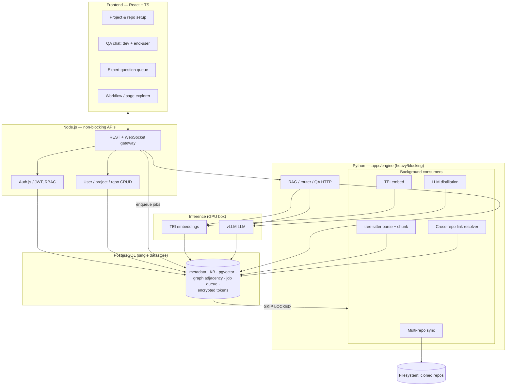

# CodeSage

> **Self-hosted, codebase-aware QA platform.** Connect your GitLab/GitHub repositories;
> CodeSage indexes them, keeps the index fresh, uses a self-hosted LLM to understand the system
> and derive its business/user workflows, and answers questions through chat — for **both
> developers** (code questions) **and end-users** (navigation, permissions, data-timing). When
> uncertain, it asks domain experts and folds their answers back as authoritative knowledge.

---

## What is CodeSage?

Every growing software team faces the same problem: the knowledge needed to answer questions lives
scattered across dozens of repos, config files, and people's memories. *Where is login handled?
What permission does this button need? How does a frontend call reach the database? When will data
show up on this page?* — developers and end-users ask these every day, and the answers are rarely
in one place.

CodeSage is a private assistant that **reads your actual source code** instead of guessing from
the public internet. You connect your GitLab or GitHub repos to a project — one product can span
many services (`frontend`, `backend`, `iam`, and so on) — and CodeSage builds a searchable map of
the codebase on your own servers. People ask questions in a chat UI; every answer comes back with
**citations** pointing to real files, symbols, or expert-verified facts. When the system is not
confident, it says so and can route the question to a domain expert rather than making something up.

Everything runs **on-prem**: your source code, embeddings, and LLM never leave your network. The
stack is fully open source and self-hostable — React, Node, Python, PostgreSQL, tree-sitter, TEI,
and vLLM. The first target is MEAN/MERN codebases (JS/TS); the design scales to roughly
**10 projects × ~3M lines of code**.

New to the stack? See [`docs/tech-learning-guide.md`](./docs/tech-learning-guide.md).

---

## How it works

Picture a smart library for your codebase. You check in your repos; background jobs clone them,
parse the source with tree-sitter, and store searchable chunks plus a code graph in PostgreSQL.
A self-hosted embedding model turns those chunks into vectors; a self-hosted LLM later distills
higher-level knowledge — workflows, page maps, permission rules, data flows — each tagged with
confidence and sources.

When someone asks a question, a router decides whether it is a **code** question (search vectors
and the graph) or a **product** question (search the distilled knowledge base). The LLM composes
a grounded reply and streams it back with citations. After each push to Git, only the changed files
are re-indexed, so the library stays current without rebuilding from scratch.



Under the hood, the system follows one simple rule:

```
React (apps/web)  →  Node (apps/api)  →  Python (apps/engine)  →  PostgreSQL
```

The Node API handles auth, CRUD, and WebSocket streaming — fast, non-blocking work only. Anything
heavy (cloning repos, parsing, embedding, distillation, retrieval) runs in Python and is stored in
a **single PostgreSQL database** — vectors, graph, job queue, and encrypted repo tokens all live
there, with no separate Redis, Qdrant, or Neo4j. Node either enqueues a background job or calls
Python and streams the result back. Manual re-index (`POST …/repos/:repoId/sync`) returns **409**
when indexing is already in progress (younger than `WORKER_STALE_JOB_SECONDS`, default 10 min).
All business logic lives in `apps/engine/src/services/`.
See [`AGENTS.md`](./AGENTS.md) before editing.

Expert answers are treated as authoritative: they outrank LLM-inferred values and survive
re-indexing. Full roadmap and phase details:
[`docs/final-solution.md`](./docs/final-solution.md) ·
[`docs/plans/phase-1-mvp-code-qa.md`](./docs/plans/phase-1-mvp-code-qa.md) ·
[`docs/plans/phase-2-multi-repo.md`](./docs/plans/phase-2-multi-repo.md).

---

## Security & trust

Repo tokens are encrypted at rest and decrypted only in memory during sync. Access is enforced with
role-based permissions scoped by project, and sensitive actions are audit-logged. Answers must be
grounded in retrieved context with citations; when evidence is weak, the system abstains rather
than hallucinating. Secrets never belong in git — document variables in
[`.env.example`](./.env.example) and keep real values in a local `.env`.

---

## Deployment

**Local development runs natively** on one machine — install Node.js, Python, and PostgreSQL,
then run each service with `npm run dev:*`. Follow the [Quickstart](#quickstart) below.

> Docker is **not** used for local development. A root `docker-compose.yml` exists only as an
> optional convenience for running the whole stack in containers; the supported local dev path is
> native (faster hot-reload, simpler debugging). Docker's real home is **production**.

**Production** splits across two on-prem machines: PostgreSQL + pgvector on Machine 1; Node API,
Python RAG, vLLM, and TEI on Machine 2 (with a 48 GB GPU). Compose files live in `deploy/db/` and
`deploy/app/`. The first full index of a large codebase can take hours to a day on one GPU;
incremental updates after that are much faster. See [`docs/final-solution.md`](./docs/final-solution.md) §11.

---

## Quickstart

### Prerequisites

| Tool | Version | Required for |
|---|---|---|
| **Node.js** | 20+ (24 recommended) | JS workspaces (`web`, `api`, `shared-types`) |
| **Python** | 3.12+ | `apps/engine` dev and tests |
| **[uv](https://docs.astral.sh/uv/)** | latest | Python deps and test runner (matches CI) |
| **PostgreSQL + pgvector** | 16+ | Single datastore — metadata, pgvector, graph, job queue ([setup](./docs/db-setup.md)) |
| **[Ollama](https://ollama.com)** | latest | Optional — local LLM + embeddings (deterministic fallback if absent) |
| **Docker + Compose** | latest | Optional — production deploy, or running the full stack in containers |

Local development is **native** — no Docker required. Run these from the **repository root**.

**1. Install the prerequisites** above: Node.js, Python, uv, and PostgreSQL with the pgvector
extension.

**2. Create the database.** Follow [`docs/db-setup.md`](./docs/db-setup.md) to create the role,
database, and `vector` extension (Windows/macOS/Linux).

**3. Configure environment.** Each service reads its **own** `.env`. Copy the two service
templates and set `DATABASE_URL` to your local Postgres (URL-encode `@` in passwords as `%40`):

```bash
cp apps/api/.env.example apps/api/.env  # Node API
cp apps/engine/.env.example apps/engine/.env  # Python RAG
```

> The **root** [`.env.example`](./.env.example) is for **Docker Compose only** — it interpolates
> `POSTGRES_*`, `DATABASE_URL`, and secrets into containers. Native dev does not need a root
> `.env` (RAG will read it as a base layer if present).

**4. Install dependencies:**

```bash
npm run setup                 # npm install + uv sync --dev (apps/engine)
```

> Types generated from `contracts/` are **checked into git**, so a fresh clone needs no codegen.
> Run `npm run codegen` only after editing `contracts/`; CI runs `codegen:check` to catch drift.

**5. Run the services** (each in its own terminal). The API applies pending migrations and seeds
dev data on startup — no separate migrate step:

```bash
npm run dev:api               # migrates + seeds, then http://localhost:3000/health
npm run dev:web               # http://localhost:5173
npm run dev:engine            # http://localhost:8001/health
```

> **Local LLM + embeddings:** install [Ollama](https://ollama.com) and pull the models — see
> [`apps/engine/README.md`](./apps/engine/README.md). Without it, RAG uses deterministic fallbacks.

### Quality gates

Run before pushing — same as CI:

```bash
npm run typecheck             # typecheck all JS workspaces
npm run lint                  # ESLint all JS workspaces
npm test                      # JS (≥ 80%) + Python (≥ 80%)
npm run build                 # build web + api + shared-types
```

Other useful targets:

```bash
npm run test:js               # JS tests only
npm run test:python           # Python tests only
npm run test:e2e              # Playwright journeys (stack + tests/e2e/.env — see tests/e2e/README.md)
npm run codegen:check         # fail if contracts/ and generated types drift
npm run lint:staged           # ESLint staged files only (pre-commit)
npm run test:staged           # related tests for staged files only (pre-commit)
```

**Pre-commit (Husky)** runs staged-only checks: `lint:staged`, `typecheck:staged`, and
`test:staged` (fast related tests, no coverage gate). Before pushing, run the full gates
locally — `npm run lint`, `npm run typecheck`, and `npm test` — same as CI.

On Linux/macOS: `make setup`, `make test`, `make lint`, `make typecheck` — see [`Makefile`](./Makefile).
(The `make up`/`down`/`migrate`/`logs` targets are optional Docker helpers, not the local dev path.)

Per-component runbooks: [`apps/api/README.md`](./apps/api/README.md) ·
[`apps/web/README.md`](./apps/web/README.md) · [`apps/engine/README.md`](./apps/engine/README.md).

Cross-service API shapes are defined once in `contracts/` and types are generated — never
hand-written. Edit contract → `npm run codegen` → implement against generated types.
CI runs `codegen:check`.

---

## Documentation

Start at [`docs/README.md`](./docs/README.md).

| Doc | What it answers |
|---|---|
| [`docs/requirement.md`](./docs/requirement.md) | Product requirements, functional/non-functional requirements, success criteria |
| [`docs/intermediate-solution.md`](./docs/intermediate-solution.md) | Technology options and trade-offs considered |
| [`docs/final-solution.md`](./docs/final-solution.md) | Locked technical solution, architecture diagrams, roadmap |
| [`docs/architecture.md`](./docs/architecture.md) | Component map, runtime flows, cross-service boundaries |
| [`docs/data-model.md`](./docs/data-model.md) | PostgreSQL schema overview — domains, relationships, trust model |
| [`docs/schema/`](./docs/schema/README.md) | Per-table column reference (one file per table) |
| [`docs/development-workflow.md`](./docs/development-workflow.md) | Branching, testing, review, Definition of Done |
| [`docs/tech-learning-guide.md`](./docs/tech-learning-guide.md) | Onboarding: each technology explained for newcomers |
| [`docs/plans/phase-1-mvp-code-qa.md`](./docs/plans/phase-1-mvp-code-qa.md) | Phase 1 milestones and build order |
| [`docs/plans/phase-2-multi-repo.md`](./docs/plans/phase-2-multi-repo.md) | Phase 2 multi-repo linking and cross-repo graph resolver |
| [`tests/e2e/README.md`](./tests/e2e/README.md) | E2E Playwright journeys (UI onboarding, public + private repo attach) |
| [`docs/adr/`](./docs/adr/README.md) | Architecture Decision Records |

Each deployable also has local docs: `README.md`, `PLAN.md`, `TODO.md`, `AGENTS.md`.

---

## Repository layout

```
codesage/
├─ README.md                 # you are here
├─ AGENTS.md                 # repo-wide conventions for humans + AI agents
├─ docs/                     # specs, architecture, ADRs, workflow, phase plans
├─ apps/
│  ├─ web/                   # React + TypeScript frontend
│  ├─ api/                   # Node + TypeScript non-blocking APIs
│  └─ engine/                # Python RAG / QA + background job consumers
├─ packages/
│  └─ shared-types/          # TS types generated from contracts/
├─ contracts/                # single source of truth for cross-service APIs
├─ tests/
│  └─ e2e/                   # Playwright cross-service journeys (see tests/e2e/AGENTS.md)
├─ db/
│  ├─ migrations/            # versioned SQL — schema source of truth
│  └─ seed/                  # dev seed data
├─ deploy/
│  ├─ db/                    # Machine 1 — PostgreSQL Compose
│  └─ app/                   # Machine 2 — api, engine, vLLM, TEI Compose
├─ scripts/                  # codegen, backup, reindex-cli
├─ .github/workflows/        # CI (JS + Python + Docker images)
└─ .env.example              # documented env vars (never commit a real .env)
```

---

## Tech stack

React + TypeScript · Node + TypeScript (Fastify) · Python (FastAPI) · PostgreSQL + pgvector ·
tree-sitter · TEI embeddings · vLLM LLM · Postgres-backed job queue · Docker Compose.

All adopted dependencies are open source and self-hostable (NFR-10).

---

## License

CodeSage is licensed under the **[PolyForm Noncommercial License 1.0.0](./LICENSE.md)** —
noncommercial use is permitted; **commercial use requires a separate license**.

Copyright © 2026 Ashok Durai Kannan. For commercial licensing, contact **ashokduraik@gmail.com**.
