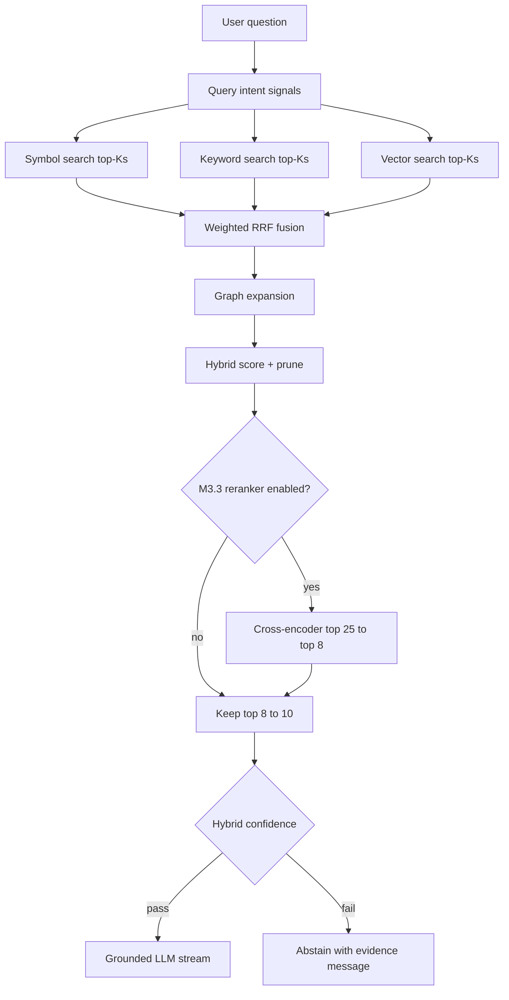

# ADR 0021 — Retrieval quality pass (dynamic weights, prune, hybrid confidence, reranker)

- **Status:** Accepted
- **Date:** 2026-07-12
- **Related:** ADR 0020 (hybrid retrieval baseline), ADR 0005 (Postgres graph), ADR 0008/0009
  (TEI embeddings + inference), ADR 0010 (thin RAG layer); `final-solution.md` §8,
  `docs/plans/phase-1-mvp-code-qa.md` §M3.2–M3.3

## Context

[M3.1 hybrid retrieval](0020-hybrid-retrieval.md) (symbol + keyword + vector → RRF → graph expand)
fixed the biggest gap versus vector-only search, but production debugging showed two remaining
problems:

1. **Equal (or near-equal) RRF weights let vector dilute precision.** When the user asks
   *"where is `UserService` defined?"* or *"what does `getMinEmi` do?"*, symbol and keyword legs
   should dominate; semantic neighbours still rank highly and flood the fused list.
2. **Too many loosely related chunks reach the LLM.** Packing 15–20 excerpts encourages survey-style
   answers even when the context window has room. Code assistants perform better with **fewer,
   highly relevant** snippets (typically **8–10** after rerank/prune).

Fixed per-retriever `TOP_K=12` and a single `RETRIEVAL_MAX_DISTANCE` gate also do not scale across
repo sizes (~50k LOC vs multi-million LOC) and do not reflect query intent (identifier lookup vs
conceptual explanation).

External review aligned with our observations: the largest accuracy jump after hybrid fusion is
**post-fusion reranking/pruning**, then **dynamic retriever weighting**, then optional
**cross-encoder reranker** — not marginal tweaks to cosine thresholds alone.

## Decision

Extend `services/retrieval/` in **two milestones** on top of ADR 0020. No new datastore; still
PostgreSQL + pgvector + `pg_trgm` + graph adjacency.

### Target pipeline (end state)



### M3.2 — Dynamic weighting, adaptive top-k, prune, hybrid confidence (next)

**1. Query-intent signals (no LLM)** — lightweight heuristics in
`services/retrieval/query_intent.py` (extends `query_terms.py`):

| Signal | Examples |
|---|---|
| Identifier-like tokens | `camelCase`, `snake_case`, `Foo()`, dotted names |
| File/path hints | `.ts`, `/`, `src/` |
| Natural-language phrasing | "how does", "explain", "lifecycle", "authentication work" |

**2. Dynamic RRF weights** — adjust per-query weights before fusion (defaults when ambiguous):

| Profile | When | Symbol | Keyword | Vector |
|---|---|---:|---:|---:|
| **symbol_lookup** | Clear identifier(s), definition/where-is questions | 5.0 | 2.0 | 0.5 |
| **conceptual** | How/explain/lifecycle, few identifiers | 1.0 | 2.0 | 4.0 |
| **balanced** | Mixed or unclear | 3.0 | 2.0 | 1.0 |

Baseline “Cursor-style” starting point when no strong signal: symbol **3**, keyword **2**, vector **1**.

**3. Adaptive per-leg top-k** — scale candidate counts from **indexed project size** (sum of
active chunk count or estimated LOC across project repos), not a single global constant:

| Tier | Approx. scale | Symbol | Keyword | Vector |
|---|---|---:|---:|---:|
| small | &lt; ~100k LOC | 5 | 8 | 8 |
| medium | ~100k–1M LOC | 5 | 10 | 12 |
| large | &gt; ~1M LOC | 5 | 12 | 20 |

`RETRIEVAL_FUSED_TOP_K` remains an upper bound before prune (e.g. 20–25).

**4. Post-graph prune** — after graph expansion, **re-score and keep top 8–10** chunks for context
packing. Do not pass the full fused+expanded list to the LLM.

**5. Hybrid confidence gate** — replace reliance on vector distance alone. Combine normalized
signals (initial weights, tunable via config):

```
confidence =
  0.40 × retrieval_score      # fused RRF + prune rank
+ 0.30 × graph_connectivity   # expanded chunk linked to seed (hop depth penalty)
+ 0.20 × symbol_exactness     # exact symbol / strong keyword hit on top results
+ 0.10 × citation_coverage    # diversity: enough distinct files to support the answer
```

Abstain when `confidence < RETRIEVAL_MIN_CONFIDENCE` (new setting) with message along the lines of
*"I couldn't find enough evidence in the indexed repository."*

**Graph centrality** (PageRank-style scores on `graph_nodes`) is **deferred** — higher complexity
and rebuild cost; revisit only if M3.2 metrics still show structural misses.

### M3.3 — Cross-encoder reranker (follow-up)

After M3.2 prune, add an optional **open-source cross-encoder reranker** (e.g. `bge-reranker-v2`
or equivalent served via TEI/OpenAI-compatible rerank API — ADR 0008/0009 posture, no paid APIs):

- Input: question + top **~25** candidates post-fusion/graph.
- Output: reorder; keep top **8** for the LLM.
- Feature-flagged (`RETRIEVAL_RERANKER_ENABLED`); off by default until latency and hosting are
  validated on target hardware.

Requires its own env/config block and may warrant a short ADR addendum if the chosen model or
serving path differs materially from TEI embeddings.

## Consequences

- **Higher precision** on identifier and symbol questions without abandoning semantic search for
  conceptual questions.
- **Fewer, better chunks** in the prompt → less survey behaviour, better citation focus.
- **More config surface** — intent profiles, adaptive tiers, confidence weights, prune size, reranker
  flags (documented in `apps/rag/.env.example`).
- **M3.2 is mostly Python** in `services/retrieval/`; no schema change required for dynamic weights
  or hybrid confidence. Adaptive tiers may read `COUNT(*)` from `code_chunks` per project (cached per
  request).
- **M3.3 adds latency** (reranker forward pass) and operational dependency on another model endpoint.

## Alternatives considered

- **Fixed weights only (3 / 2 / 1):** simpler than dynamic profiles but still lets vector dilute
  symbol-heavy queries; rejected as the long-term default, acceptable as the “balanced” profile.
- **Skip prune; only lower `TOP_K`:** does not help after graph expansion adds cross-repo chunks.
- **Graph centrality in M3.2:** powerful for structural questions but needs precomputed scores and
  more tuning; deferred.
- **Paid rerank APIs (Cohere/Jina):** violates open-source / self-hosted posture; rejected.
- **Immediate reranker without M3.2:** adds ops cost before fixing weighting and prune; rejected.

## Escape hatch

- Reranker remains **optional** and isolated behind `services/retrieval/rerank.py`.
- If TEI rerank serving is unsuitable on low-spec hosts, M3.2 alone (dynamic weights + prune +
  hybrid confidence) still ships value; reranker can wait or use a smaller local model.
- Retrieval quality modules stay behind `services/retrieval/` per ADR 0010 so a future dedicated
  search engine (ADR 0004 escape hatch) can replace individual legs without changing `/rag/query`.
