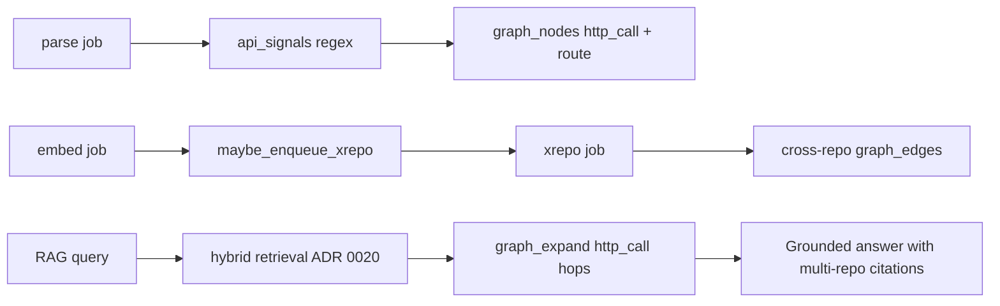

# ADR 0023 — Cross-repo linking (regex API signals + `xrepo` job + graph-augmented retrieval)

- **Status:** Accepted
- **Date:** 2026-07-12
- **Related:** ADR 0005 (Postgres graph adjacency), ADR 0006 (Postgres job queue), ADR 0007
  (tree-sitter parsing), ADR 0010 (thin RAG layer), ADR 0020/0021 (hybrid retrieval);
  `final-solution.md` §6.3, `docs/plans/phase-2-multi-repo.md`

## Context

Phase 1 indexes and answers questions within a **single repository**. Real microservice systems
span multiple repos (frontend, backend, IAM). Developer questions often cross those boundaries —
*"where does this Angular service call land in Express?"* or *"what permission check runs after
this route?"* — but Phase 1 retrieval only sees chunks and graph edges inside one repo.

`final-solution.md` §6.3 and `intermediate-solution.md` §7 lock the approach: per-repo subgraphs
unified at the **project** level with **cross-repo `graph_edges`**, matched by HTTP method +
normalized path. Phase 2 must deliver that without a new datastore (ADR 0003) or graph engine
(ADR 0005).

## Decision

Implement cross-repo linking in **three milestones** on top of the existing parse → embed
pipeline. All logic lives in `apps/engine/src/services/`; Node only enqueues jobs.

### M1 — API signal extraction during parse

During tree-sitter parse (`services/graph/extract.py`), run **regex extractors** in
`services/graph/api_signals.py` on JS/TS source:

| Pattern | Node kind | Key |
|---|---|---|
| `fetch('…')` | `http_call` | `GET /path` (fetch defaults to GET) |
| `axios.{get,post,…}('…')` | `http_call` | `METHOD /path` |
| `.http.{get,post,…}('…')` (Angular `HttpClient`) | `http_call` | `METHOD /path` |
| `app|router.{get,post,…}('…')` (Express) | `route` | `METHOD /path` |

`normalize_api_path()` keeps only **relative paths starting with `/`** and strips trailing
slashes so host-specific URLs do not pollute matching. Signals become `graph_nodes` linked to
their file via `contains` edges during parse — no separate parse pass.

**Deferred for Phase 2:** OpenAPI/Swagger spec ingestion, backend → IAM heuristics beyond
shared method+path matching, low-confidence links → `expert_questions` (Phase 5).

### M2 — Cross-repo link resolver (`xrepo` job)

After **every active repo** in a project has `last_indexed_at` set, `maybe_enqueue_xrepo()`
(`services/indexing/xrepo_enqueue.py`) inserts one `xrepo` job per project (deduped while
pending/running). The handler (`services/xrepo/run_xrepo.py` → `link_resolver.py`):

1. Deletes prior cross-repo `http_call` edges for the project (idempotent re-run).
2. Loads all `http_call` and `route` nodes project-wide.
3. For each call whose `name` key (`METHOD /path`) matches a route in a **different**
   `repo_id`, inserts a cross-repo `graph_edges` row with `kind = 'http_call'`.
   Match exact keys first; fall back to segment-wise template matching for
   Express/OpenAPI-style parameterized routes (`:id`, `{id}`).

Job shape: `XrepoPayload { projectId }` in `contracts/jobs.schema.json`. Re-queue after
incremental embed (Phase 3) so links stay current when API paths change.

### M3 — Graph-augmented retrieval

The `graph_expand` agent tool in `services/qa/tools.py`:

1. Accepts a graph node selected from prior evidence.
2. Walks outgoing `http_call` edges (including cross-repo) up to
   `retrieval_graph_max_depth`.
3. Returns one active indexed chunk per newly reached file.

The tool is always available to the planner. Depth and extra-chunk caps live in
`config/constants.py`; traversal never runs automatically after fusion.

## Consequences

- Developer QA can cite **frontend and backend files** in one answer when the question spans
  repos.
- Matching is **deterministic and fast** (regex + string key) — no LLM in the linking path.
- **False positives** are possible when two services expose the same `METHOD /path` prefix;
  graph expansion may pull the wrong backend until OpenAPI or expert validation is added.
- **False negatives** when paths are built dynamically (template literals, config-driven URLs)
  — regex cannot see runtime values.
- `xrepo` is **project-scoped and idempotent**; safe to re-run after every embed completion.
- No schema migration beyond existing `graph_nodes`/`graph_edges` kinds.

## Alternatives considered

- **LLM-based link inference:** flexible but slow, non-deterministic, and violates self-hosted
  cost/latency for a batch job; rejected for Phase 2.
- **OpenAPI-only matching:** misses hand-written Express routes and dynamic clients; deferred as
  a strengthener, not the primary signal.
- **Separate graph service / Neo4j:** violates ADR 0003/0005; rejected.
- **Synchronous linking in parse:** blocks embed completion and cannot see all repos; rejected —
  project-level job after full index is simpler and idempotent.

## Escape hatch

- Add OpenAPI spec parsing and confidence scores on edges; route low-confidence matches to
  `expert_questions` (Phase 5) without changing the `xrepo` job contract.
- If regex coverage is insufficient, add tree-sitter queries for HTTP client/route AST nodes
  alongside regex (same `ApiSignal` shape).
- Graph expansion remains behind the `graph_expand` tool — a future dedicated graph engine
  (ADR 0005 escape hatch) can replace traversal without changing `/engine/query`.
