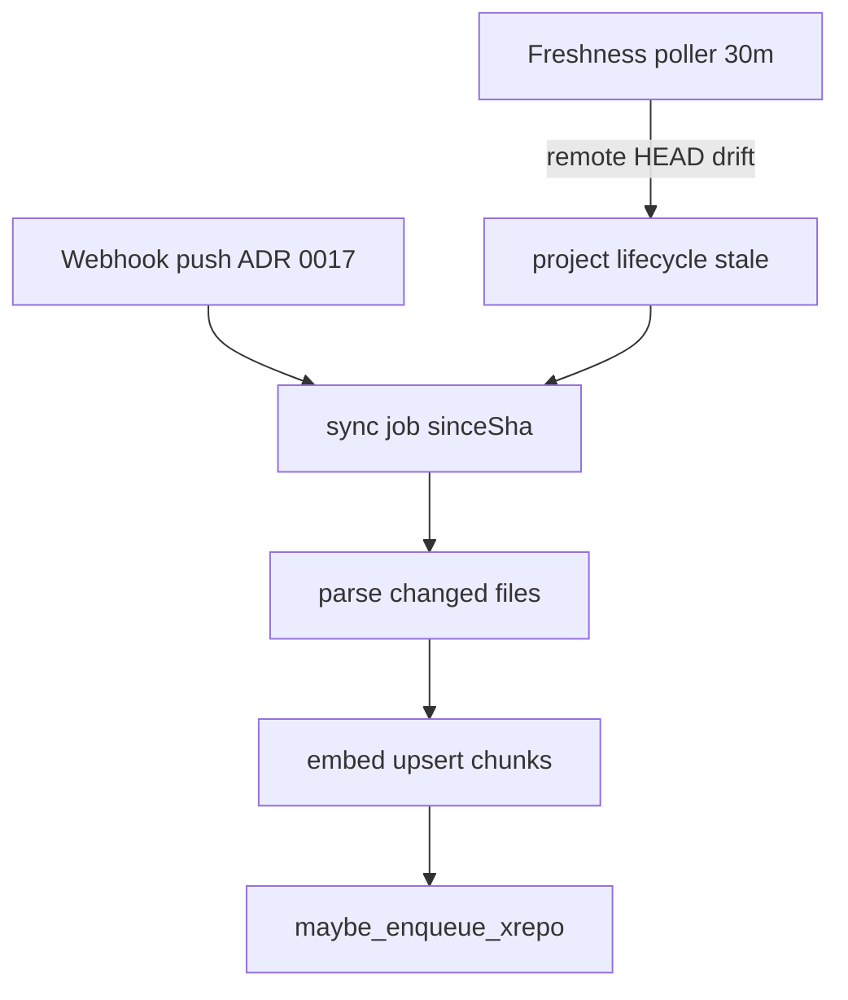

# ADR 0024 — Freshness scheduled poll fallback (`git ls-remote` + `cron_poll` sync)

- **Status:** Accepted
- **Date:** 2026-07-12
- **Related:** ADR 0006 (Postgres job queue), ADR 0017 (webhook registration on connect),
  ADR 0023 (re-queue `xrepo` after embed); `final-solution.md` §6.2,
  `docs/plans/phase-3-freshness.md`

## Context

[ADR 0017](0017-webhook-registration-on-connect.md) registers provider push webhooks on repo
attach — the **primary** freshness trigger (NFR-5: re-index within minutes of a push). Webhooks
fail silently in common self-hosted setups: `WEBHOOK_BASE_URL` unreachable from GitHub/GitLab,
insufficient token scope, firewall rules, or users who attach public repos without tokens.

Phase 3 requires a **fallback** that detects remote drift and enqueues incremental sync without
user action. The incremental pipeline (`git diff` vs `last_indexed_sha`, re-parse, re-embed,
`xrepo` refresh) is shared with the webhook path — only the **discovery** mechanism differs.

## Decision

Add a **background freshness poller** in the Python worker deployable alongside the job consumer.

### Discovery — `services/freshness/poll_repos.py`

On each poll pass:

1. List every **active, indexed** repo (`last_indexed_at` set, `status = 'A'`).
2. Skip repos with a pending or running `sync` job (no duplicate work).
3. Decrypt `token_enc` when present; call `resolve_remote_head()` (`git ls-remote`) for the
   configured branch.
4. When `remote_sha ≠ last_indexed_sha`:
   - Set project `lifecycle_status` to **`stale`** (UI shows drift before sync starts).
   - Cancel pending jobs for that repo (supersede stale work).
   - Enqueue `sync` with `trigger: "cron_poll"` and `sinceSha: last_indexed_sha`.

On transient `git ls-remote` failure, log a warning and **skip** that repo for this pass — do not
mark stale or enqueue.

### Scheduling — `workers/freshness_poller.py`

- Daemon thread started with the worker process; sleeps `freshness_poll_interval_seconds`
  between passes (default **1800 s / 30 min** in `config/constants.py`).
- Feature-flagged: `FRESHNESS_POLL_ENABLED` in `.env.example` (default `true`).
- Uses its own SQLAlchemy session per pass; commits after enqueue.

### Shared incremental path (webhook + poll)

Both triggers enqueue the same `sync` → `parse` → `embed` chain:

| Trigger | Set by | `sinceSha` |
|---|---|---|
| `webhook_push` | Node webhook intake (ADR 0017) | prior `last_indexed_sha` |
| `cron_poll` | Freshness poller | prior `last_indexed_sha` |

After embed completes, `maybe_enqueue_xrepo()` re-runs cross-repo linking (ADR 0023). Marking
derived-knowledge artifacts stale and distillation re-run are **Phase 4** — out of scope here.

## Consequences

- Indexes **eventually converge** when webhooks are disabled or missed — within one poll interval
  plus sync duration.
- **`stale` lifecycle** gives the UI a visible signal between drift detection and sync start
  (webhook path sets `connecting` immediately on push).
- Poll adds **low-rate `git ls-remote` traffic** per indexed repo — acceptable for internal
  deployments; interval is tunable via env override.
- No new datastore or scheduler (no cron container, no Redis) — honors ADR 0006.
- Private repos require `token_enc` + `TOKEN_ENC_KEY`; public repos poll without a token.

## Alternatives considered

- **Polling-only (no webhooks):** simpler ops but misses NFR-5 latency; webhooks remain primary
  per ADR 0017.
- **Node-side poll cron:** would block or need its own thread; heavy git work belongs in Python
  per ADR 0002.
- **External cron hitting an API endpoint:** extra moving part; in-process daemon thread is
  sufficient for MVP scale.
- **Poll all repos including never-indexed:** wastes `ls-remote` on attaching repos; restricted
  to indexed rows.

## Escape hatch

- Replace the daemon thread with a **Kubernetes CronJob** or system cron calling a one-shot CLI
  when horizontal worker scaling makes in-process polling undesirable — keep `poll_stale_repos()`
  as the single entry point.
- Add **exponential backoff** per repo after repeated `ls-remote` failures if provider rate
  limits become an issue.
- Tighten interval or add org-level webhooks (ADR 0017 escape hatch) before adding a separate
  scheduler service.
