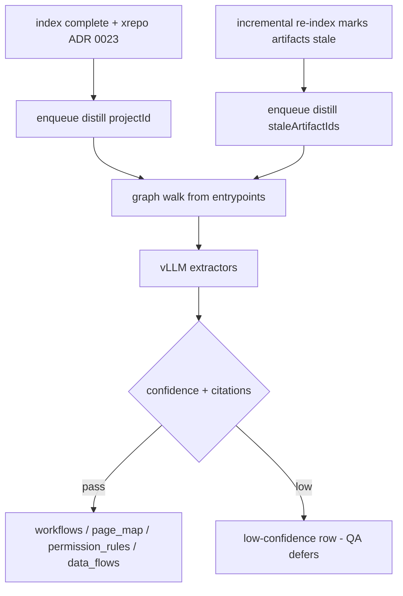

# ADR 0025 — Distillation of derived product knowledge (workflows, pages, permissions, data-flows)

- **Status:** Proposed
- **Date:** 2026-07-12
- **Related:** ADR 0005 (Postgres graph adjacency), ADR 0006 (Postgres job queue), ADR 0009
  (vLLM inference), ADR 0010 (thin RAG layer), ADR 0018 (audit columns), ADR 0023 (cross-repo
  linking); `final-solution.md` §7.1, §12 (Phase 4), `docs/data-model.md` §2.3

## Context

Phases 1–3 deliver **code-level** QA: retrieve chunks, traverse the graph, answer developer
questions with citations, and keep the index fresh. They do **not** produce the **product-level
understanding** CodeSage promises — *"what does the checkout workflow do?"*, *"who can access
this page?"*, *"where does this number come from?"*. Those answers require **derived knowledge**
distilled from the code graph, not raw chunks.

`final-solution.md` §7.1 and the planned schema tables (`workflows`, `page_map`,
`permission_rules`, `data_flows` — see `docs/schema/`) lock the target: LLM distillation walks
the project graph from entrypoints and produces structured artifacts, each carrying **confidence
+ source citations** (NFR-7). Phase 4's exit criterion is *"derived knowledge queryable for one
project"*. This is the first phase where the LLM **writes persistent knowledge**, so grounding
and trust rules are load-bearing.

## Decision

Implement distillation as a **background job** (`distill`) in `apps/rag/src/services/distill/`,
consuming the code graph and emitting the four derived-knowledge tables. No new datastore
(ADR 0003); no framework ownership of the pipeline (ADR 0010).

### Job & trigger

- Payload `DistillPayload { projectId, staleArtifactIds? }` already exists in
  `contracts/jobs.schema.json` and generated types — implement the handler against it.
- **Full derive:** enqueued when a project first finishes indexing (after `xrepo`, ADR 0023).
- **Incremental derive:** Phase 3 incremental re-index marks artifacts touching changed files
  **stale**; only those `staleArtifactIds` are re-derived (avoids re-distilling the whole
  project on every push). Job is idempotent and project-scoped/deduped like `xrepo`.

### Pipeline (`services/distill/`)

1. **Entrypoint discovery** — walk `graph_nodes` from routes/handlers/UI components using
   recursive CTEs (ADR 0005), including cross-repo `http_call` edges (ADR 0023).
2. **Per-artifact extractors** (prompts live only in `services/distill` + `services/llm`,
   per the one-concern rule):
   - `workflows` — business/user flows spanning repos, ordered `steps` with citations.
   - `page_map` — routes → components → data sources.
   - `permission_rules` — guards, middleware, RBAC config, Angular `*ngIf` role checks.
   - `data_flows` — API → service → DB/cache/queue with `freshness_type`.
3. **Grounding + confidence** — every row is written with `confidence` (0–1) and `source_refs`
   citing code chunks or graph nodes. Rows below `DISTILL_MIN_CONFIDENCE` are still persisted
   but flagged low-confidence; the QA path must abstain or defer rather than present them as
   authoritative.
4. **Persistence** — repositories upsert derived rows with mandatory audit columns (ADR 0018)
   and row `status` (soft delete). Expert overrides (Phase 5) win over distilled values and
   survive re-derivation — distillation must **not** overwrite `is_override` rows.

### Model & cost posture

- Use the **larger vLLM model** for distillation (ADR 0009); it is the GPU-heavy, batchable
  workload. Router/QA keep the smaller/faster model.
- Distillation is **eventually consistent** — the first full pass over a large project may take
  hours (`final-solution.md` §5.2). It runs entirely in the worker deployable; Node never blocks.

### Scope boundary

- **In scope (Phase 4):** the four derived tables, the `distill` job, full + incremental derive,
  confidence/citation persistence, developer/admin queryability for one project.
- **Deferred:** raising `expert_questions` on low confidence and expert overrides (Phase 5);
  the product-audience router and page-scoped end-user QA (Phase 6). Distillation writes the
  confidence signal Phase 5 will consume, but does not build the queue.

## Consequences

- CodeSage gains **product-level answers** grounded in citations — the core differentiator.
- Introduces the first **LLM-written persistent state**; trust depends on confidence + citation
  discipline and on incremental staleness so stale knowledge does not linger.
- **Migrations required** — the four tables are currently `Status: planned`; each needs a
  migration plus updated `docs/data-model.md` and `docs/schema/<table>.md` in the same change.
- Adds meaningful **GPU cost and initial-index latency**; mitigated by incremental re-derive.
- Distillation config (min confidence, graph walk depth/limits, batch sizes) are **tuning
  constants** in `config/constants.py` per ADR 0022; only feature toggles/endpoints go in
  `.env.example`.

## Alternatives considered

- **On-demand distillation at query time:** too slow and non-deterministic for interactive QA;
  rejected — derive ahead as a background job.
- **Store derived knowledge as free-text blobs:** loses queryability and citation structure;
  rejected in favor of explicit columns per `data-model.mdc`.
- **Skip confidence, always answer:** violates NFR-7 grounding; rejected.
- **Re-derive whole project on every push:** wasteful at 3M LOC; rejected in favor of
  `staleArtifactIds` incremental derive.
- **Separate distillation microservice now:** premature; keep it in the single Python deployable
  (ADR 0015) until scaling requires a split.

## Escape hatch

- If distillation latency dominates, split the worker into its own deployable (ADR 0015 escape
  hatch) so distill scales independently of sync/parse/embed.
- If a single large model is too slow/expensive, add a cheaper first-pass extractor with the
  large model only for low-confidence artifacts — behind `services/distill` without contract
  changes.
- Keep extractors behind `services/distill/` so a future agentic/graph-RAG approach can replace
  individual extractors without touching the `distill` job contract or the derived-table schema.
