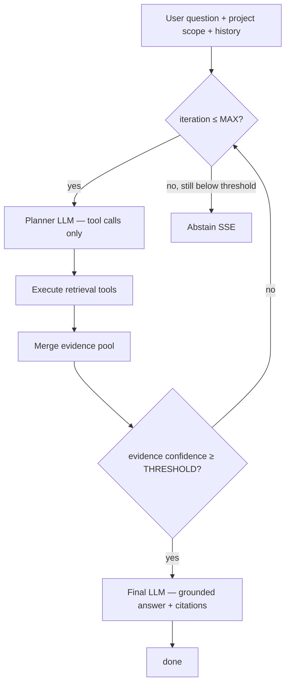

# ADR 0026 — Agent-orchestrated developer QA (tool loop, evidence confidence, grounded citations)

- **Status:** Accepted
- **Date:** 2026-07-16
- **Supersedes (orchestration only):** [ADR 0020](./0020-hybrid-retrieval.md) (fixed retrieve-then-answer pipeline),
  [ADR 0021](./0021-retrieval-quality-pass.md) (pipeline-level prune, pre-LLM abstain, pipeline reranker wiring)
- **Retains:** [ADR 0020](./0020-hybrid-retrieval.md) retriever implementations (symbol, keyword, vector, RRF),
  [ADR 0021](./0021-retrieval-quality-pass.md) `compute_hybrid_confidence` formula and adaptive top-k,
  [ADR 0003](./0003-postgresql-single-datastore.md), [ADR 0004](./0004-pgvector-for-vectors.md),
  [ADR 0005](./0005-postgres-graph-adjacency.md), [ADR 0010](./0010-thin-rag-layer.md),
  [ADR 0019](./0019-persist-chat-history-in-postgres.md), [ADR 0023](./0023-cross-repo-linking.md)
  (cross-repo graph as a tool)
- **Related:** [ADR 0027](./0027-qa-investigation-playbooks.md) (learned retrieval paths — depends on this ADR),
  [ADR 0028](./0028-followup-qa-context.md) (follow-up rewrite + priorEvidence seed before planner),
  `final-solution.md` §8, `requirement.md` NFR-7, `apps/engine/src/services/qa/stream_answer.py`,
  `contracts/openapi.engine.yaml`

## Context

### Problem

Before this ADR, developer QA followed a **fixed pipeline** implemented in `stream_answer.py`:

1. Optional small-talk short-circuit (`services/router/small_talk.py`).
2. Monolithic `retrieve_code_chunks()` — parallel symbol + keyword + vector search, weighted RRF,
   automatic graph expansion, prune to 8–10, optional cross-encoder rerank.
3. **Pre-LLM abstain** when `is_confident_match()` fails (`RETRIEVAL_MIN_CONFIDENCE`, default
   `0.45`).
4. Pack all pruned excerpts into **one** LLM prompt; stream a single grounded answer.

Production debugging (documented in ADR 0020) showed this architecture fails in predictable ways:

- The correct file may be retrieved but **buried** among loosely related neighbours; the LLM
  produces a generic codebase survey instead of tracing the specific logic.
- **Pre-abstain** rejects questions where a different retrieval strategy would have succeeded.
- **Automatic graph expansion** and **pipeline reranking** run regardless of whether the question
  needs them — adding latency and noise at scale.
- The model never gets a second chance to gather evidence.

### Scale target (explicit)

This ADR targets **accurate developer QA on a single project up to ~5M lines of indexed source**
(one repo or many repos in one project). This is **stricter than** the current documented capacity
objective in `final-solution.md` (≈3M LOC per project × 10 projects). The 5M figure is an
**explicit product target for retrieval + QA quality** on one project; hardware sizing in
`intermediate-solution.md` §5 must be revisited when implementation validates chunk counts and
query latency at that scale (see §Scale below).

**Stated sizing assumptions at 5M LOC** (not measured facts — must be validated in implementation):

| Quantity | Estimate | Assumption |
|---|---|---|
| Indexed LOC (one project) | up to **5M** | Product target for this ADR |
| `code_chunks` rows (one project) | **~80k–125k** | AST-aware chunks ≈ 40–60 LOC each |
| `graph_nodes` (one project) | **~400k–800k** | functions/classes/routes/signals |
| `graph_edges` (one project) | **~1.5M–4M** | calls, imports, `http_call` |
| Query-time vector leg top-k (xlarge tier) | **bounded** (see §Config) | adaptive top-k must cap work per tool call |

At 5M LOC the failure mode is not “search returns nothing” but “search returns **too much** of
the wrong thing.” An agent that **iterates with targeted tools** addresses that failure mode
better than tuning a single upfront fusion pass.

### Constraints (unchanged)

- **Single datastore** — PostgreSQL + pgvector + `pg_trgm` + graph adjacency (ADR 0003).
- **Node never blocks** on heavy QA work — engine owns the agent loop (ADR 0002).
- **NFR-7** — every answer must be grounded with citations; abstain when evidence is insufficient.
- **No LLM access to SQL or pgvector internals** — tools expose domain operations only.
- **Query-time context from indexed snapshots** — tools read `code_chunks` / `graph_nodes`, not
  arbitrary filesystem reads at query time (extends ADR 0020; see §Tools).
- **Contracts-first** — new SSE chunk shapes and persisted trace fields go through `contracts/`
  and codegen (ADR 0001).
- **Open-source / self-hosted only** — no paid retrieval or rerank APIs.

### What this ADR does *not* decide

- **Product / end-user QA** (`audience = end_user`) — still Phase 6; this ADR covers the
  **developer** path only until product tools (`search_docs`, etc.) are specified in a follow-up.
- **Fine-tuning** the LLM on code or retrieval traces — out of scope; learning is covered in
  ADR 0027 via persisted playbooks, not weight updates.
- **Which exact vLLM model** supports tool calling — implementation must probe/document supported
  models; the agent loop requires an OpenAI-compatible **tools / function-calling** API.

---

## Decision

Replace the fixed retrieve-then-answer pipeline with an **agent-orchestrated evidence loop** for
all developer QA requests. There is **no feature flag** and **no hybrid-confidence pre-abstain**
before the agent runs.

### Target architecture



### Orchestration rules (normative)

1. **Single code path** — every developer question enters the agent loop. Remove dedicated
   branches for small-talk, monolithic `retrieve_code_chunks()` as the QA entrypoint, and
   pipeline-level `is_confident_match()` pre-abstain.
2. **Max iterations** — `QA_AGENT_MAX_ITERATIONS` (default **5**). One iteration = one planner
   LLM turn that may emit zero or more tool calls, tool execution, evidence merge, confidence
   evaluation.
3. **Confidence gate** — after each iteration, compute **deterministic** evidence confidence
   (§Confidence). When `confidence >= QA_AGENT_MIN_CONFIDENCE` (default **0.8**), stop gathering
   and run the **final answer** step. When iteration count reaches the max and confidence is still
   below threshold, **abstain** — do not generate an ungrounded answer.
4. **Planner vs answerer** — the orchestrator controls the final answer step. The planner prompt
   must not be the only guardrail; code only invokes the answer stream when the confidence gate
   passes (or when the §Social-turn exception applies).
5. **Mandatory evidence** — the final prompt includes **only** excerpts from the evidence pool
   (chunks returned by tools in this request). No tool results → confidence stays `0` → abstain at
   max iterations.
6. **Citations** — emit `citation` SSE chunks for each distinct evidence chunk added to the pool.
   Final answer text must reference file paths present in the pool; optional post-validation may
   abstain if the answer cites paths outside the pool (implementation detail, required for NFR-7).
7. **Social turns** — greetings/thanks are handled via the **planner system prompt** (“reply in one
   sentence without tools”). If the planner emits **no tool calls** and the question matches a
   documented social pattern, the orchestrator may stream a short reply **without** running the
   confidence gate or final code-QA answerer. Remove `services/router/small_talk.py` as a
   separate bypass.

### Retrieval tools (normative surface)

Tools are implemented in `apps/engine/src/services/qa/tools.py` as thin wrappers over existing
repositories. The LLM receives JSON Schema descriptions only.

| Tool | Purpose | Backend (existing) | Notes |
|---|---|---|---|
| `search_symbols(query)` | Symbol name lookup | `repositories/symbols.symbol_search` | Scoped by `project_id`, optional `repo_ids` |
| `search_code(query)` | Keyword / identifier search in chunk text | `repositories/keyword.keyword_search` | `pg_trgm`; query terms extracted from `query` |
| `search_vectors(query)` | Semantic similarity | `repositories/vector.similarity_search` + `EmbeddingClient` | Embeds `query` once per call |
| `search_hybrid(query)` | Parallel three-leg search + weighted RRF | `retrieval/fusion`, `query_intent`, `adaptive_top_k` | Recommended first tool when planner is uncertain |
| `graph_expand(node_id)` | Walk outgoing edges from a graph node | `repositories/graph_queries.expand_graph_neighbors` | Includes cross-repo `http_call` per ADR 0023. **Always available** — no `RETRIEVAL_GRAPH_ENABLED` toggle. Caps: `RETRIEVAL_GRAPH_MAX_DEPTH`, `RETRIEVAL_GRAPH_MAX_EXTRA_CHUNKS`. |
| `read_symbol(qualified_name)` | Exact symbol → overlapping chunk(s) | `graph_nodes` + `code_chunks` join | Accepts `symbol_name` or `file_path::symbol_name` per `QaQualifiedSymbolName` |
| `read_chunk(chunk_id)` | Fetch one indexed excerpt by id | `CodeChunkRepository` | For drill-down after search results |

**Not in scope for v1 of this ADR:** `search_docs` (derived KB — Phase 4–6), `read_file(path)`
reading the git worktree at query time (contradicts ADR 0020 snapshot rule). If full-file context
is required, implement `read_chunks_for_path(path)` returning **all active chunks** for that path
from `code_chunks`, merged in span order, with a strict token cap.

**Tool result shape (internal, stable):**

```json
{
  "tool": "search_symbols",
  "query": "getMinEmi",
  "hits": [
    {
      "chunkId": "uuid",
      "repoId": "uuid",
      "filePath": "src/loan.utils.ts",
      "span": { "startLine": 10, "endLine": 55 },
      "excerpt": "...",
      "scores": { "symbol": 0.92, "fused": null },
      "graphNodeId": "uuid-or-null"
    }
  ],
  "truncated": false
}
```

Tool handlers must enforce **per-call result limits** and **excerpt token caps** so one iteration
cannot fill the entire model context.

### Evidence pool and confidence

**Evidence pool** — deduplicated set of hits keyed by `chunkId`, accumulated across iterations.
Each entry stores provenance (`tool`, `iteration`).

**Confidence score** — reuse `compute_hybrid_confidence()` from `hybrid_confidence.py` on the
**best N** pool entries (default N = `QA_AGENT_CONFIDENCE_TOP_N`, initially **10**), with:

- `intent` from `classify_query_intent(question, terms)` computed **once** per request.
- `terms` from `extract_search_terms(question)` computed **once** per request.
- Matches normalized to `RetrievalMatch` (synthetic fused scores allowed when only one leg fired).

Also apply `has_hard_vector_fail()` on those top matches: if it returns true **and** no symbol or
keyword leg in the pool exceeds minimum similarity, treat confidence as **below threshold** even
if the composite score is high (preserves ADR 0021 vector-only false-positive guard).

**Threshold** — `QA_AGENT_MIN_CONFIDENCE` default **0.8** (stricter than legacy
`RETRIEVAL_MIN_CONFIDENCE` 0.45). Tunable in `config/constants.py` per ADR 0022.

**Important:** confidence measures **quality of retrieved evidence**, not LLM self-assessment.
The model must not report its own confidence to pass the gate.

### Final answer step

When the gate passes:

1. Build messages from `CODE_QA_SYSTEM_PROMPT` (or successor), trimmed `history`, user question,
   and **only** evidence pool excerpts (same citation discipline as today).
2. Stream tokens via existing vLLM client path.
3. Emit `metrics` including: `contextChunks`, `contextTokens`, `agentIterations`,
   `evidenceConfidence`, `toolCallCount` (contract extension required).

### Removed / demoted components

| Component | Action |
|---|---|
| `services/router/small_talk.py` | **Remove** — social handling via planner prompt |
| `retrieve_code_chunks()` as QA entry | **Demote** — logic split into tool handlers + optional `search_hybrid` |
| Pipeline auto `augment_matches_with_graph` | **Demote** — only via `graph_expand` tool |
| `RETRIEVAL_GRAPH_ENABLED` env toggle | **Remove** — agent decides when to call `graph_expand`; depth/extra caps remain in `constants.py` |
| `prune_matches` before LLM | **Remove from QA path** — pool size controlled per tool + pool cap |
| `RETRIEVAL_RERANKER_*` pipeline wiring in `search.py` | **Remove from QA path** — optional rerank inside a tool later if eval proves value |
| `is_confident_match` pre-abstain | **Remove** — replaced by per-iteration gate + max-iteration abstain |
| `_pack_context` fixed packing | **Replace** — evidence pool packing for final answer only |

The follow-up cleanup removed the legacy retrieval entrypoint, prune/reranker modules, and
standalone small-talk bypass. `stream_answer.py` now delegates developer requests to the agent loop.

### LLM requirements

- **Planner model** — must support OpenAI-compatible tool / function calling (vLLM or Ollama with
  a documented model). The implementation extends `services/llm/vllm_client.py`.
- **Failure modes** — if the backend does not support tools, startup health check fails with a
  clear configuration error (do not silently fall back to the legacy pipeline).
- **Two roles** — may use the same model weights with different prompts, or a smaller model for
  planning and a larger for final answer (optional optimization; not required for v1).

### SSE contract extensions

Add to `EngineAnswerChunkType` in `contracts/openapi.engine.yaml`:

| Type | Purpose |
|---|---|
| `tool_start` | Planner invoked a tool (name + args summary for UI/debug) |
| `tool_result` | Tool finished (hit count, truncated flag; no full excerpts in SSE) |

Extend `AnswerMetrics` with optional `agentIterations`, `evidenceConfidence`, `toolCallCount`.

Persist the full investigation trace on the assistant `messages` row — see ADR 0027
(`investigation_trace` JSONB).

### Configuration (defaults in `constants.py`)

| Constant | Default | Purpose |
|---|---|---|
| `QA_AGENT_MAX_ITERATIONS` | `5` | Max planner loops per question |
| `QA_AGENT_MIN_CONFIDENCE` | `0.8` | Evidence gate to allow final answer |
| `QA_AGENT_CONFIDENCE_TOP_N` | `10` | Matches considered for confidence |
| `QA_AGENT_MAX_POOL_CHUNKS` | `20` | Hard cap on evidence pool size |
| `QA_AGENT_MAX_TOOL_HITS` | `8` | Max hits returned per tool call |
| `QA_AGENT_MAX_EXCERPT_TOKENS` | `512` | Per-chunk excerpt cap in tool results |
| `QA_AGENT_PLANNER_TIMEOUT_SECONDS` | `60` | Planner LLM timeout per iteration |
| `RETRIEVAL_ADAPTIVE_XLARGE_MIN_CHUNKS` | `100000` | New tier boundary for 5M LOC projects |
| `RETRIEVAL_VECTOR_TOP_K_XLARGE` | `20` | Vector leg top-k for xlarge projects |
| `RETRIEVAL_KEYWORD_TOP_K_XLARGE` | `12` | Keyword leg top-k for xlarge projects |
| `RETRIEVAL_SYMBOL_TOP_K_XLARGE` | `5` | Symbol leg top-k for xlarge projects |

Retire `RETRIEVAL_MIN_CONFIDENCE` from the QA abstain path (may remain for metrics only until
removed).

### Scale and performance (5M LOC)

**Per-request cost upper bound (design target):**

- ≤ 5 planner LLM calls + 1 final answer call.
- ≤ 5 × (≤ 4 tool calls) × embedding cost for `search_vectors` / `search_hybrid`.
- All DB work bounded by adaptive top-k per leg and `QA_AGENT_MAX_TOOL_HITS`.

**Indexing / DB (unchanged posture):**

- HNSW index on `code_chunks.embedding` must remain cached on Machine 1 (ADR 0004).
- At ~100k+ chunks per project, implementation must verify pgvector query latency stays within
  product SLO (define in implementation — e.g. p95 < 500ms per vector leg on recommended hardware).

**xlarge adaptive tier** — extend `adaptive_top_k.py` with a fourth tier when active chunk count
≥ `RETRIEVAL_ADAPTIVE_XLARGE_MIN_CHUNKS`. Vector top-k may increase versus large tier but must
stay below a hard ceiling (implementation proposes ≤ 25; validate by benchmark).

**No unbounded graph walks** — `graph_expand` respects `RETRIEVAL_GRAPH_MAX_DEPTH` and
`RETRIEVAL_GRAPH_MAX_EXTRA_CHUNKS` per call. There is **no** `RETRIEVAL_GRAPH_ENABLED` feature
toggle; the tool is always registered for the planner.

### Implementation milestones

| Milestone | Deliverable | Outcome |
|---|---|---|
| **A** | Tool handlers + unit tests | **Complete** — seven bounded tools in `services/qa/tools.py` |
| **B** | `agent_loop.py` + confidence gate | **Complete** — deterministic confidence gate and abstain tests |
| **C** | Tool-calling LLM client + SSE `tool_*` chunks | **Complete** — contracts/codegen and pass-through implemented; UI v1 ignores progress events |
| **D** | Replace `stream_answer` entry; remove dead branches | **Complete** — developer E2E journey implemented with documented live-stack requirements |
| **E** | xlarge adaptive tier + 5M LOC fixture benchmark | **Partial** — xlarge tier complete; manual 5M LOC benchmark deferred |

### Testing requirements

- Colocated tests: `test_agent_loop.py`, `test_qa_tools.py` — ≥ 80% line + branch on new code.
- Scenarios: symbol lookup, conceptual question, cross-repo `graph_expand`, max-iteration abstain,
  social turn without tools, empty index abstain, citation path validation.
- Regression suite comparing **answer citation precision** on a fixed question set (ADR 0020 EMI
  example must be included).

---

## Consequences

### Positive

- **Higher accuracy** on multi-hop and identifier-heavy questions — planner can retry with different
  tools instead of failing a one-shot retrieval.
- **Fewer false abstains** — low first-pass confidence triggers another iteration instead of
  immediate abstain.
- **Less noise** — graph expansion and reranking run only when the planner requests them.
- **Clearer debugging** — `tool_start` / `tool_result` and persisted traces expose investigation
  steps (feeds ADR 0027).
- **Scales in investigation depth, not context width** — avoids packing 10+ weak excerpts into one
  prompt at 5M LOC.

### Negative

- **Higher baseline latency** — most questions pay at least one planner LLM call before the answer.
- **Higher GPU cost** — up to 6 LLM calls per question (5 planner + 1 answer) in worst case.
- **Model dependency** — requires tool-calling support; model swaps need regression tests.
- **Stricter abstain rate** — threshold 0.8 vs legacy 0.45 pre-gate may increase abstains on
  borderline conceptual questions unless iterations consistently improve evidence.
- **Contract + UI work** — new SSE types and metrics fields.

### Migration

- The ADR 0027 migration adds `messages.investigation_trace` and `qa_playbooks`.
- Deploy as a breaking **behavior** change on `/engine/query` (same URL; different internal flow).
- `apps/engine/README.md`, `docs/plans/phase-1-mvp-code-qa.md`, and `docs/README.md` document the
  accepted agent path.

---

## Alternatives considered

| Alternative | Why rejected |
|---|---|
| **Keep fixed pipeline + optional agent flag** | User requirement: single path, no flag |
| **Agent loop only when confidence < 0.8 on first retrieve** | Still wastes work on a monolithic first pass; two paths to maintain |
| **LLM self-reported confidence** | Unreliable for anti-hallucination; not auditable |
| **LangGraph as orchestration backbone** | ADR 0010 rejected framework-owned orchestration; custom loop stays testable |
| **Expose SQL / pgvector to the LLM** | Security and correctness risk; violates thin-tool design |
| **read_file from git worktree at query time** | Breaks single-source-of-truth with index; stale risk — ADR 0020 |
| **Keep pipeline reranker** | Agent selects and narrows evidence; reranker adds latency without clear gain in agent model |
| **Keep small_talk bypass** | Special case conflicts with single-path goal; planner handles it |

---

## Escape hatch

- If tool-calling models prove too unreliable on self-hosted hardware, a **deterministic playbook
  executor** (ADR 0027 warm-start) can run iteration 1 without planner LLM — without reverting the
  full fixed pipeline.
- If latency at 5M LOC exceeds SLO, reduce `QA_AGENT_MAX_ITERATIONS`, add planner result caching
  per session, or split planner onto a smaller quantized model.
- Individual tools remain swappable per ADR 0010; a future search engine (ADR 0004 escape hatch)
  replaces repository implementations, not the agent contract.
- If composite confidence at 0.8 is too strict, tune `QA_AGENT_MIN_CONFIDENCE` and component weights
  — not LLM judgment.

---

## Resolutions recorded at acceptance

| # | Question | Owner / when |
|---|---|---|
| 1 | Exact `qualified_name` format for `read_symbol` | **Resolved** — `symbol_name` or `file_path::symbol_name` (`QaQualifiedSymbolName` in `contracts/openapi.engine.yaml`) |
| 2 | Supported vLLM / Ollama models for tool calling in CI and prod | **Resolved** — require OpenAI-compatible tool calling; `/health` reports `plannerTools`. Ollama model families and vLLM behavior are documented in `apps/engine/README.md`; CI uses mocked HTTP rather than asserting a live model id |
| 3 | Product SLO for p95 end-to-end QA at 5M LOC (seconds) | **Deferred** — no benchmark artifact or measured p95 exists. Run the documented manual benchmark before setting the product SLO; record results in `docs/plans/agent-qa/benchmark-results.md` |
| 4 | Whether `search_hybrid` is mandatory on iteration 1 or planner-opt-in | **Resolved** — planner-opt-in. The prompt recommends targeted tools when known and `search_hybrid` when unsure; warm-start may deterministically replay a validated playbook |
| 5 | Citation post-validation strictness (warn vs abstain) | **Resolved for v1** — citations and final context are restricted to evidence-pool paths, and the prompt requires those paths. There is no post-stream answer-text abstain validator |
