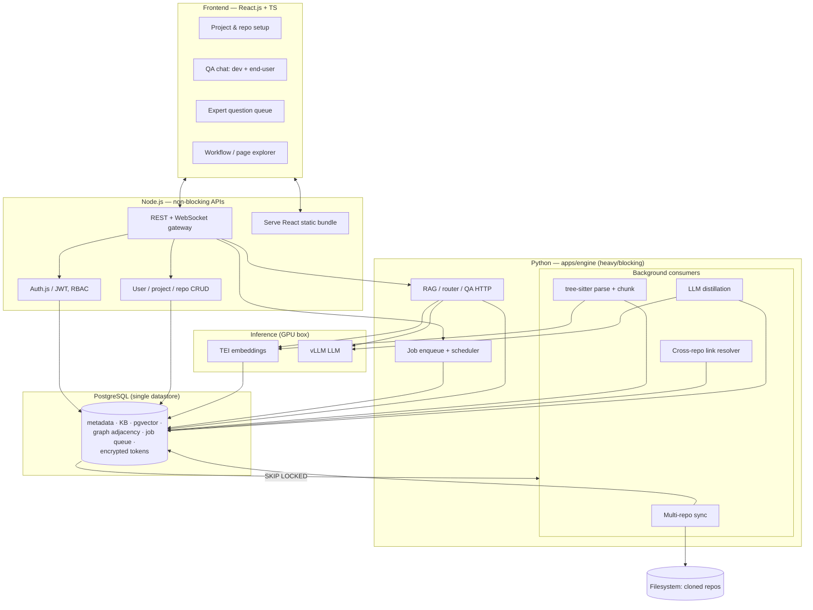
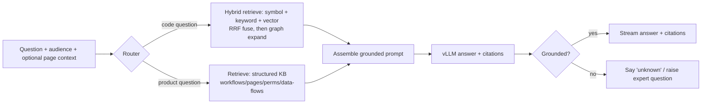

# CodeSage — Final Solution

> **Status:** v1.0 (finalized)
> **Companions:** `requirement.md` (what & why), `intermediate-solution.md` (options & trade-offs)
> **Last updated:** 2026-06-22
>
> This document is the **finalized** technical solution. All technology decisions are locked.
> It is the basis for implementation.

---

## 1. Summary

**CodeSage** is a self-hostable, open-source platform that connects an organization's
GitLab/GitHub repositories, indexes them, continuously keeps them fresh, uses an LLM to
**understand the system and derive its business/user workflows**, and answers questions
through chat — for **both developers** (code questions) **and end-users** (navigation,
permissions, data-timing). When uncertain, CodeSage **asks domain experts** clarifying
questions and folds their answers back as authoritative knowledge.

- **First target codebases:** MEAN / MERN (MongoDB, Express, Angular/React, Node.js — JS/TS).
- **A project = one or more repos** (microservices: `frontend`, `backend`, `iam`, …).
- **Capacity objective:** up to **10 projects × ~3M LOC** (≈30M LOC total).
- **Constraints:** open-source only (no paid products/services); private code/tokens stay internal.

---

## 2. Finalized technology stack

| Layer | Technology | License |
|---|---|---|
| Frontend | **React.js + TypeScript** | MIT |
| Non-blocking APIs | **Node.js + TypeScript** (static serving, auth, user/project/repo CRUD) | MIT |
| Heavy/blocking backend | **Python** (sync, parse, index, distill, RAG/QA) | PSF |
| Parsing | **tree-sitter** — JS/TS/TSX (Layer A) + HTML/CSS/SCSS + `tree-sitter-angular` (Layer B) | MIT |
| Single datastore | **PostgreSQL** — metadata, KB, **pgvector** vectors, graph adjacency, **job queue**, encrypted tokens | PostgreSQL |
| Job queue | **Postgres-backed** — Procrastinate or `SELECT … FOR UPDATE SKIP LOCKED` | MIT / — |
| Embeddings | **Self-hosted code embedding model via TEI** (`halfvec` storage) | Apache 2.0 |
| LLM inference | **Open-weight model via vLLM** (Ollama for dev) behind a provider abstraction | Apache 2.0 / MIT |
| Reranker (optional) | **Open-source cross-encoder via TEI** | Apache 2.0 |
| RAG | **Thin custom retrieval layer** + LlamaIndex primitives | MIT |
| Auth | **Auth.js / JWT** (Keycloak later if SSO required) | ISC |
| Packaging | **Docker** containers | Apache 2.0 |
| Orchestration | **Docker Compose** (2 machines); Kubernetes deferred | Apache 2.0 |

> **Only stateful service = PostgreSQL** (with pgvector). Everything else is stateless
> app/worker/inference containers plus a filesystem for cloned repos.

---

## 3. System architecture



**Boundary rule:** Node never blocks on heavy work. It performs CRUD/auth synchronously,
enqueues indexing/distillation jobs (rows in Postgres), and calls the Python RAG service for
QA (streaming the answer back over WebSocket). Background jobs run in the same `apps/engine`
deployable (Procrastinate / `SKIP LOCKED`).

---

## 4. Repository / service layout

A single Git **monorepo** with strict boundaries. The layout is optimized for two goals:
**maintainability** (clear domain modules, colocated tests, one source of truth per concern)
and **AI-friendliness** (predictable conventions, `AGENTS.md` guidance files, a generated
cross-language API contract so an agent never has to guess request/response shapes).

### 4.1 Top level

```
codesage/
├─ AGENTS.md               # Repo-wide conventions & guardrails for AI agents (and humans)
├─ README.md               # Quickstart, architecture map, links to docs/
├─ .env.example            # Env-specific vars + feature toggles (never commit real secrets); RAG tuning defaults live in apps/engine/src/config/constants.py
├─ Makefile / justfile     # One-liners: setup, dev, test, lint, migrate, seed
├─ docker-compose.yml      # Local dev (all services on one host)
├─ contracts/              # ★ SINGLE SOURCE OF TRUTH for cross-service APIs
│  ├─ openapi.node.yaml    #   Public Node REST/WS API
│  ├─ openapi.engine.yaml     #   Internal Python RAG API
│  ├─ jobs.schema.json     #   Job queue payload schemas (Node enqueues → Python consumes)
│  └─ README.md            #   "Edit here, then run codegen" — types are generated, not hand-written
├─ apps/                   # Deployable user-facing apps
│  ├─ web/                 # React + TS frontend
│  ├─ api/                 # Node + TS — non-blocking APIs
│  └─ rag/                 # Python — RAG/QA HTTP + background job consumers
├─ packages/               # Shared, non-deployable libraries (TS only for MVP)
│  └─ shared-types/        # TS types GENERATED from contracts/ (used by web + api)
├─ db/
│  ├─ migrations/          # Versioned SQL migrations (Postgres) — source of truth for schema
│  └─ seed/                # Dev seed data & fixtures
├─ deploy/
│  ├─ db/compose.yml       # Machine 1 (PostgreSQL + pgvector)
│  └─ app/compose.yml      # Machine 2 (api, rag, vllm, tei)
├─ docs/                   # requirement.md, intermediate-solution.md, final-solution.md, ADRs
│  └─ adr/                 # Architecture Decision Records (one file per decision)
└─ scripts/                # Dev/ops scripts (codegen, backup, reindex-cli)
```

> **Why `contracts/` matters most here:** Node and Python don't share code, so the API
> contract is the one thing that *must not* drift. Defining it once (OpenAPI/JSON Schema) and
> **generating** TS + Pydantic types from it keeps both sides in sync and gives AI agents an
> unambiguous spec to read before touching either side.

### 4.2 Frontend — `apps/web/` (feature-based)

```
web/src/
├─ features/              # One folder per feature; colocated UI + hooks + api calls + tests
│  ├─ projects/           # create project, attach repos
│  ├─ chat/               # QA chat (dev + end-user), WS streaming, citations
│  ├─ expert-queue/       # answer clarifying questions
│  └─ explorer/           # workflow / page / permission browser
├─ shared/                # Reusable UI components, hooks, lib
├─ api/                   # Thin client generated/typed from contracts/
└─ app/                   # Routing, providers, layout
```

### 4.3 Node API — `apps/api/` (module-per-domain)

```
api/src/
├─ modules/               # Each = routes + service + repository + tests, no cross-imports of internals
│  ├─ auth/               # Auth.js / JWT, RBAC
│  ├─ users/
│  ├─ projects/
│  ├─ repos/              # attach repo, token encryption, branch config
│  ├─ chat/               # WS gateway → proxies to apps/engine (streams)
│  ├─ knowledge/          # read workflows / pages / permissions / data-flows
│  ├─ questions/          # expert queue read + answer
│  └─ webhooks/           # provider push → enqueue re-index job
├─ platform/              # db client, queue (enqueue), config, logging, error handling
└─ http/                  # server bootstrap, middleware, OpenAPI wiring
```

### 4.4 Python backend — `apps/engine/` (layered)

```
apps/engine/
├── src/                  # All Python code
│   ├── api/              # HTTP — FastAPI app, routes (thin)
│   ├── workers/          # Background jobs — Procrastinate dispatch (thin)
│   ├── services/         # Business logic — parsing, retrieval, LLM, distill, …
│   ├── repositories/     # Data access — repos, session, pgvector/graph queries
│   ├── models/           # SQLAlchemy ORM + enums
│   └── config/           # Settings, env, secrets
└── tests/                # pytest (outside src)
```

**Dependency rule:** `api/` and `workers/` call `services/`; `services/` call `repositories/`;
`repositories/` use `models/`. No business logic in `api/` or `workers/`.

### 4.5 Conventions (enforced, so humans and agents stay consistent)

- **`AGENTS.md` at root + key packages** — states the boundaries (e.g. "Node never does heavy
  work", "edit `contracts/` then run codegen", "business logic goes in `services/`, not in
  `api/` or `workers/`"), the test/lint commands, and naming rules.
- **Tests colocated** with code (`*.test.ts`, `test_*.py`) plus `tests/e2e/` for cross-service.
- **One concern = one place:** DB schema only in `db/migrations/`; API shapes only in
  `contracts/`; prompts only in `apps/engine/src/services/llm` + `apps/engine/src/services/distill`.
- **No deep cross-module imports** — modules expose a public surface (`index.ts` / `__init__.py`);
  internals stay private. This is what makes large-codebase edits safe for an AI agent.
- **Small, single-purpose files** with descriptive names over large grab-bag files.
- **ADRs in `docs/adr/`** capture *why* a decision was made (great context for future agents).

---

## 5. Data model (PostgreSQL)

All persistence lives in one Postgres instance. Key tables (illustrative columns):

| Table | Purpose | Notes |
|---|---|---|
| `users` | accounts, roles | roles: admin, expert, developer, end_user |
| `projects` | logical system | one per microservice system |
| `repos` | repos in a project | `project_id`, `repo_url`, `provider`, `branch`, `role`, `token_enc`, `last_indexed_sha` |
| `code_chunks` | RAG units + vectors | `embedding halfvec(N)` (HNSW index), `file_path`, `span`, `repo_id` |
| `graph_nodes` | files/classes/functions/routes | `kind`, `name`, `repo_id`, `file_path`, `span` |
| `graph_edges` | calls/imports/callers | `src_id`, `dst_id`, `kind`; **may be cross-repo** |
| `workflows` | derived business/user flows | `name`, `steps[]` (code refs), `confidence` |
| `page_map` | UI pages/routes | `route`, `components[]`, `data_sources[]`, `confidence` |
| `permission_rules` | per page/action permission | `target`, `required_permission`, `source_refs[]`, `confidence` |
| `data_flows` | per-page data origin/freshness | `source_chain[]`, `freshness_type`, `confidence` |
| `expert_questions` | clarification queue | `context_ref`, `question`, `status`, `confidence_trigger` |
| `expert_answers` | authoritative overrides | `question_id`, `author`, `answer`, `is_override=true` |
| `conversations` / `messages` | QA history | `audience` (dev \| end_user), `citations[]` |
| `jobs` | the job queue | `type`, `payload`, `status`, `attempts`, `locked_at` (or Procrastinate-managed) |
| `audit_log` | security/audit | `actor`, `action`, `target`, `ts` |

**Derived-knowledge trust:** every `workflow` / `page_map` / `permission_rule` / `data_flow`
row carries a **confidence** and **source citations**. Expert answers create high-trust
overrides that win over LLM-inferred values and survive re-indexing.

---

## 6. Indexing pipeline

### 6.1 Initial index (per repo, on project/repo creation)
1. Decrypt token → clone repo to the filesystem (read-only deploy token).
2. Enumerate files; filter by extension/size; skip vendored/build dirs.
3. **Parse** with tree-sitter → extract `graph_nodes` (files, classes, functions, routes) and
   `graph_edges` (calls, imports).
4. **Chunk** AST-aware (≈ function/40–60 LOC windows) → embed via **TEI** → store in
   `code_chunks` (pgvector, `halfvec`).
5. Record `last_indexed_sha`.

### 6.2 Continuous freshness (incremental)
1. **Webhook** (push) + **cron poll** fallback enqueue a re-index `job` per repo.
2. Worker `git diff` vs `last_indexed_sha` → changed files only.
3. Re-parse changed files; upsert affected `graph_nodes`/`graph_edges`; re-embed changed
   `code_chunks`; delete removed entities.
4. Mark derived artifacts (`workflows`/`page_map`/… touching those files) **stale**.
5. Enqueue distillation for stale artifacts only.

### 6.3 Cross-repo linking (microservices)
- After per-repo parse, the **cross-repo link resolver** matches **API contracts**: frontend
  `fetch`/`axios`/Angular `HttpClient` calls ↔ Express route declarations (method + path), and
  backend ↔ IAM/auth calls. Where present, OpenAPI/Swagger specs strengthen matching.
- Confident matches → cross-repo `graph_edges`. Low-confidence matches → `expert_questions`.

---

## 7. Understanding, distillation & expert-in-the-loop

### 7.1 Distillation (background, GPU)
Walk the project graph from entrypoints (routes/handlers/UI components) and use **vLLM** to
produce, with citations + confidence:
- **workflows** (e.g. "login", "checkout") spanning repos,
- **page_map** (routes → components → data sources),
- **permission_rules** (route guards, middleware, RBAC config, Angular `*ngIf` role checks),
- **data_flows** (API → service → DB/cache/queue; sync/async/cached/polled/event-driven).

### 7.2 Expert loop
- Any derived fact below a confidence threshold, or contradictory, becomes an
  `expert_question` attached to the relevant code location.
- Experts answer in the queue UI → stored as `expert_answers` (overrides) → reused on future
  re-indexes (no duplicate questions); artifact confidence is promoted.

---

## 8. QA serving (LLM + RAG)



1. A small fast model (the **router**) classifies the question as **code** vs **product**, and
   whether it is **page-scoped** (uses the user's current route as context).
2. **Code** → **hybrid retrieval** over `code_chunks`: symbol, keyword (`pg_trgm`), vector
   (pgvector); **weighted RRF** by query intent; graph expansion; **prune to 8–10** chunks;
   optional cross-encoder rerank (M3.3); **hybrid confidence** abstain (ADR 0020, ADR 0021).
   **Product** → structured retrieval from `workflows`/`page_map`/`permission_rules`/`data_flows`.
3. The larger model assembles a **grounded answer with citations** (to code or expert-verified
   knowledge).
4. If unsupported by retrieved context → respond "not certain" and optionally raise an
   `expert_question` instead of hallucinating.

**End-user examples handled by the product path:** "How do I navigate this page?" (page_map),
"What permission do I need for this action?" (permission_rules), "When will data appear here?"
(data_flows).

---

## 9. API surface (high level)

**Node.js (public, non-blocking):**
- `POST /auth/login`, `POST /users` — Auth.js / JWT, RBAC.
- `POST /projects`, `POST /projects/:id/repos` — create project + attach repos (URL + token).
- `GET /projects/:id/workflows | pages | questions` — read derived knowledge & queue.
- `POST /projects/:id/questions/:qid/answer` — expert answers.
- `WS /chat` — QA streaming (proxied to the Python RAG service).
- `POST /webhooks/:provider` — push events → enqueue re-index job.

**Python (internal only, `apps/engine`):**
- `POST /engine/query` — router + retrieval + grounded answer (SSE/stream).
- Background queue consumers — `sync`, `parse`, `embed`, `xrepo`, `distill` (same deployable).

---

## 10. Security

- **Tokens:** least-privilege read-only deploy tokens; **encrypted at rest** in Postgres
  (app-level envelope encryption). A dedicated vault can be added later if policy requires.
- **Network:** code, embeddings, and LLM inference all run on internal machines; no source
  code leaves the network (all inference is self-hosted).
- **AuthZ:** RBAC on projects (expert vs developer vs end_user); audit logging of sensitive
  actions.
- **Hallucination control:** grounded-only answers with citations; "unknown" path + expert
  questions for gaps.

---

## 11. Hardware & deployment

### 11.1 Hardware (two on-prem machines)
- **Machine 1 — Database:** 16 cores, 64–128 GB RAM, 1 TB NVMe SSD (RAID1), no GPU. Runs
  PostgreSQL + pgvector.
- **Machine 2 — Application + GPU:** 16–32 cores, 64–128 GB RAM, 500 GB–1 TB NVMe,
  **1× 48 GB GPU** (L40S/A6000). Runs Node API, Python `apps/engine`, vLLM, TEI.

> **GPU = 1× 48 GB** (finalized): runs a 14B fp16 / quantized-32B class model + the embedding
> model — the MVP sweet spot for "understanding" quality. Scale out (more GPUs / Kubernetes)
> later to shrink the initial-index window or raise QA concurrency.

> **Initial-index time:** the first distillation pass over large codebases takes **hours to
> 1–2 days** on one GPU; embeddings finish quickly; incremental updates are cheap thereafter.

### 11.2 Deployment (Docker Compose)
- **Machine 1:** `docker-compose.db.yml` → PostgreSQL (pgvector).
- **Machine 2:** `docker-compose.app.yml` → `api` (Node), `rag` (Python — HTTP + background jobs),
  `vllm`, `tei`.
- **~4 app services, 1 datastore.** Split Python into separate worker/RAG deployables when
  workers/inference need independent scaling (see ADR 0015).

---

## 12. Phased delivery roadmap

| Phase | Deliverable | Exit criteria |
|---|---|---|
| **0. Foundation** | Monorepo, Postgres + migrations, Auth.js, Compose skeleton | Login works; create project/repo; CI builds images. |
| **1. MVP — code QA** | Clone → tree-sitter parse → embed (TEI) → pgvector; RAG QA via vLLM with citations (developer audience) | Ask a code question on 1 repo, get a correct cited answer. |
| **2. Multi-repo** | Multiple repos per project + cross-repo link resolver | A workflow/graph query spans frontend→backend→iam. |
| **3. Freshness** | Webhooks + cron → incremental re-index (per repo) | Push triggers re-index within minutes. |
| **4. Distillation** | workflows + page/permission/data-flow maps with confidence | Derived knowledge queryable for 1 project. |
| **5. Expert loop** | question queue + authoritative overrides | Low-confidence fact → question → answer → reused. |
| **6. End-user QA** | router + page-scoped product answers | "What permission for this action?" answered from KB. |
| **7. Hardening** | observability, backups, cost controls, (optional) Keycloak SSO, K8s | Production runbook; scale tested across 10 projects. |

---

## 13. Working assumptions (correct if wrong)

- **QA concurrency is low** (internal users) → a single 48 GB GPU suffices for MVP.
- **Understanding depth is phased** — developer code-Q&A ships first (Phase 1); full
  distillation and end-user QA arrive in Phases 4–6.
- **SSO not required at launch** — Auth.js/JWT now; Keycloak later if needed.
- Languages beyond MEAN/MERN (JS/TS) are out of scope for the first release.

---

## 14. Out of scope (first release)

- Public multi-tenant SaaS, IDE autocomplete, automated PR review/bug-finding, general-purpose
  wiki hosting, languages beyond JS/TS.
