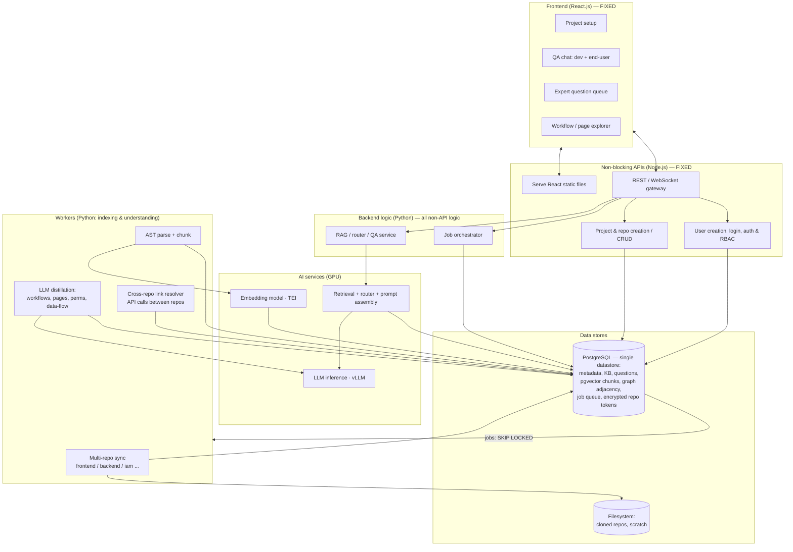

# CodeSage — Intermediate Solution: Technology & Architecture

> **Status:** v1.0 — ALL decisions finalized. Promoted to `final-solution.md`.
> **Companion to:** `requirement.md`
> **Last updated:** 2026-06-13
>
> Goal of this document: propose the architecture and, for each technology decision,
> present the **best options + trade-offs + a recommendation**. Fixed constraints:
> **React.js** frontend; **Node.js for all non-blocking APIs** (static file serving, user
> creation, login/auth, project & repo creation, CRUD); **all heavy/blocking work in
> Python** (repo sync, parsing, indexing, LLM distillation, RAG/QA); **open-source-only**
> (no paid products/services). Once finalized, the actual solution/implementation will follow.
>
> **Context:** first target codebases are **MEAN/MERN** (MongoDB, Express, Angular/React,
> Node.js — JS/TS). A **project may be microservice/multi-repo** (e.g. `frontend`,
> `backend`, `iam`).
>
> **Capacity objective:** serve up to **10 projects**, each up to **~3M LOC** (≈30M LOC
> total). This drives the hardware sizing in §5.
>
> **Decisions locked in this revision (to minimize MVP moving parts):**
> parsing = **tree-sitter** (§3.2); vectors = **pgvector** (§3.3); code graph = **Postgres
> adjacency tables** (§3.4); metadata/KB = **PostgreSQL** (§3.5); job queue =
> **Postgres-backed** (§3.6). Net effect: **a single datastore (PostgreSQL)** for metadata,
> vectors, graph, and the queue — no Redis, no Qdrant, no Neo4j, no separate broker. MVP
> deployment = **Docker Compose on two machines** (§5); Kubernetes deferred.

---

## 1. Guiding principles

1. **Open source only** — every adopted technology must be open source / free to self-host.
   No paid products or commercial-only services (NFR-10).
2. **Container-based, deployment-flexible** — package as containers so the same artifacts run
   under Docker Compose or Kubernetes, on-prem or hosted (topology finalized later). Keeping
   private code/tokens internal remains a design goal.
3. **Two knowledge layers** — raw code knowledge (for developers) and *derived* product
   knowledge (workflows, page/permission/data-flow maps for end-users). Architecture must
   serve both.
4. **Ground everything** — every answer cites code or expert-verified knowledge; no
   ungrounded answers.
5. **Incremental at scale** — ~3M LOC means full re-indexing is too expensive; deltas only.
6. **Project = one or more repos** — indexing, the code graph, and workflows operate at the
   **project** level and span all of a project's repositories (cross-repo edges included).
7. **Expert-in-the-loop** — uncertainty becomes a question, not a hallucination.

---

## 2. System architecture (logical view)

> **Node.js** owns the **non-blocking APIs**: serving the React bundle, user creation,
> login/auth, project & repo CRUD, and WebSocket streaming. It **delegates all heavy/blocking
> work** (repo sync, parsing, indexing, distillation, retrieval, QA) to **Python**
> `apps/engine` over the queue + an internal API.

---

## 3. Technology decisions (options · trade-offs · recommendation)

### 3.0 Web layer (FIXED by requirement)
- **Frontend:** React.js (with TypeScript recommended).
- **Node.js owns all non-blocking APIs:** serving the React static files, user creation,
  login/auth & RBAC, project & repo creation/CRUD, and WebSocket streaming. It does **not**
  host the heavy/blocking backend logic.
- TypeScript strongly recommended for both for type safety across a large surface.

---

### 3.1 Work split — Node vs Python (FIXED by requirement)

The split is by **blocking profile**: Node handles fast, non-blocking request/response and
CRUD; Python handles CPU/GPU-heavy and long-running work. This also plays to each ecosystem's
strengths (Node's I/O concurrency; Python's parsing + ML/RAG libraries).

- **Node.js (non-blocking APIs):** static serving, user creation, login/auth & RBAC,
  project/repo CRUD, request validation, WebSocket streaming of answers to the browser.
- **Python (heavy/blocking work):** repo sync, AST parsing, embedding, vector/graph indexing,
  LLM distillation, the question router, retrieval, and QA answer assembly.
- **Contract between them:** Node calls Python via an **internal HTTP/gRPC API** for
  synchronous QA, and enqueues **jobs on the queue** for async indexing/distillation. Node
  never blocks on heavy work — it returns job handles and streams results.

No decision needed; documented here for clarity.

---

### 3.2 Code parsing / AST — ✅ DECIDED: tree-sitter

| Option | Pros | Cons |
|---|---|---|
| **tree-sitter** | Fast, incremental, 40+ languages, one consistent API. | Per-language grammar setup; not full semantic analysis. |
| **Language-native parsers** (e.g. javaparser, Roslyn, Python `ast`) | Deepest semantic accuracy per language. | N different toolchains; high maintenance. |
| **LSP servers** | Rich symbol/reference data. | Heavy to run at scale; designed for editors, not batch. |

- **Decision: tree-sitter** (MIT, open source) as the universal backbone.
- **Grammars to ship for MEAN/MERN:**
  - **Layer A (code knowledge — primary):** `tree-sitter-javascript` (includes JSX),
    `tree-sitter-typescript` (`typescript` + `tsx`). This is where functions, API calls,
    routes, and logic live — the high-value targets for the call-graph and workflows.
  - **Layer B (product knowledge — secondary but needed):** `tree-sitter-html`,
    `tree-sitter-css`/`tree-sitter-scss`, and the community **`tree-sitter-angular`** grammar
    for Angular template microsyntax (`*ngIf`, `{{ }}`, `[prop]`, `(event)`). Angular `.ts`
    component files are covered by the TS grammar, but `.html` **templates are not plain HTML**
    and need these grammars — they hold permission-gated UI (e.g.
    `*ngIf="user.hasRole('admin')"`) and routing that feed the page/permission maps.
- **Mixed-language files** (script/style inside HTML, CSS-in-JS) are handled via tree-sitter
  **language injections**; JSX/TSX is parsed natively (no injection needed).
- **Later (optional):** a TS-native enricher (TypeScript compiler API via a Python-invoked
  sidecar) for deeper type/symbol resolution to strengthen cross-repo API linking.

---

### 3.3 Vector database (semantic code retrieval) — ✅ DECIDED: pgvector

| Option | Pros | Cons |
|---|---|---|
| **pgvector (in Postgres)** | One fewer system; transactional with metadata; HNSW index. | Fewer ANN knobs than dedicated stores; very-large-scale tuning needed. |
| **Qdrant** | Fast, hybrid (vector+payload filter), great DX. | Another service to run. |
| **Weaviate** | Hybrid search, modules, mature. | Heavier; more config. |
| **Milvus** | Scales to billions of vectors. | Operationally complex; overkill early. |

- **Decision: pgvector** (PostgreSQL extension, open source) — chosen to **minimize moving
  parts** by keeping vectors in the same database as metadata and the graph. At our scale
  (~0.5M–1.5M vectors total, see §5) pgvector with an **HNSW index** is comfortable.
- **Note for scale:** use `halfvec` (fp16) to roughly halve vector storage, and budget RAM so
  the HNSW index stays cached (see §5). If we ever outgrow pgvector (many millions of vectors,
  heavy hybrid filtering), **Qdrant** is the documented migration target — but not for MVP.

---

### 3.4 Code graph storage — ✅ DECIDED: Postgres adjacency tables

| Option | Pros | Cons |
|---|---|---|
| **Postgres adjacency tables** | Reuse existing DB; simple; good enough for most traversals. | Deep/recursive traversals less elegant. |
| **Neo4j** | Purpose-built graph queries (Cypher), great for multi-hop. | Extra system + license considerations; ops overhead. |
| **In-memory graph (per query)** | Fast, simple. | Doesn't persist; rebuild cost at 3M LOC. |

- **Decision: Postgres adjacency tables** (`graph_node`, `graph_edge`), traversed with
  recursive CTEs. Keeps the graph in the same datastore (no extra system). The **cross-repo
  edges** (frontend → backend → IAM) live here, scoped per project.
- **Escape hatch:** if multi-hop traversals become a measured bottleneck, migrate to
  **Neo4j Community Edition** (GPLv3) later — not needed for MVP.

---

### 3.5 Metadata / knowledge-base database — ✅ DECIDED: PostgreSQL

Stores projects, repos, users, the knowledge base (workflows, page map, permission map,
data-flow map), expert questions/answers, and audit logs — **and** (per §3.3/§3.4/§3.6) the
vectors, the code graph, and the job queue.

| Option | License | Pros | Cons |
|---|---|---|---|
| **PostgreSQL** | PostgreSQL (OSI) | Relational integrity, JSONB for flexible KB docs, **pgvector** for embeddings, recursive CTEs for the graph, `SKIP LOCKED` for the queue — **one engine for everything**. | Schema migrations; less "natural" for deeply nested docs. |
| **MongoDB (Community Server)** | SSPL (source-available, free to self-host) | Document model fits nested KB artifacts; team knows it (MEAN/MERN). | SSPL not OSI open source; weaker joins/integrity; would still need a separate vector + graph + queue story → **more moving parts**. |
| **MySQL/MariaDB** | GPL | Familiar, solid. | Weaker JSON/extension story; no pgvector equivalent. |

- **Decision: PostgreSQL** as the **single datastore**. The deciding factor is the MVP goal
  of **minimal moving parts**: Postgres covers metadata + KB (JSONB), vectors (pgvector),
  graph (adjacency + recursive CTEs), and the job queue (`SKIP LOCKED`) in one engine.
- **Why not MongoDB here:** despite team familiarity, Mongo would still leave vectors, graph,
  and queue to solve separately — the opposite of consolidation. Revisit only if the
  knowledge-base artifacts prove painful to model relationally.
- **Repo tokens:** stored **encrypted at rest in Postgres** for MVP (e.g. app-level
  envelope encryption), avoiding a separate secrets-vault service. A dedicated vault can be
  added later if policy requires.

---

### 3.6 Job queue / async orchestration — ✅ DECIDED: Postgres-backed queue

**Why a queue is needed at all** (the part to be clear on):

1. **Indexing can't run inside an HTTP request.** Cloning + parsing + embedding + distilling
   3M LOC takes **minutes to hours**. Node must enqueue the work, return immediately
   ("indexing started"), and let a Python worker process it asynchronously.
2. **Survivability / retries.** Across millions of lines, transient failures happen (a file
   fails to parse, the embedder hiccups, a worker restarts). The queue persists jobs and
   retries the failed unit instead of losing the whole run.
3. **Concurrency control.** With 10 projects, you must cap how many index/re-index jobs run
   at once so they don't saturate GPU/CPU, and prioritize interactive QA over background
   distillation.
4. **Landing spot for re-index triggers.** Webhooks (push) and the cron poll both simply
   **enqueue a job**, absorbing bursts cleanly.

| Option | Pros | Cons |
|---|---|---|
| **Postgres-backed queue** (Procrastinate, or `SELECT … FOR UPDATE SKIP LOCKED`) | **No new service** — reuses the DB we already run; transactional with data writes. | Not built for huge throughput (fine here); fewer queue features than brokers. |
| **Celery + Redis/Valkey** | Mature Python ecosystem; rich features. | Adds Redis/Valkey as a service to run + back up. |
| **Temporal** | Durable workflows, retries, visibility for long multi-step pipelines. | Heavier to operate; learning curve. |

- **Decision: a Postgres-backed queue** — **Procrastinate** (Python, Postgres-only, uses
  `LISTEN/NOTIFY`) or a hand-rolled `jobs` table polled with `SKIP LOCKED`. This honors the
  MVP "minimal moving parts" goal: **no Redis, no broker** — the queue lives in the database
  we already have, and gives us all four benefits above.
- **Escape hatch:** if job volume/throughput ever outgrows Postgres, move to **Celery +
  Valkey** (BSD) or **Temporal** (MIT). Not needed for MVP.

---

### 3.7 Embedding model — ✅ DECIDED: self-hosted code embeddings via TEI

| Option | Pros | Cons |
|---|---|---|
| **Code-specialized open model** (e.g. via TEI / vLLM serving) | Better code retrieval; runs on-prem. | Needs GPU/CPU serving infra. |
| **General open embedding model** | Easy, decent quality. | Less tuned for code semantics. |
| **External embedding API** | Best quality, zero infra. | **Sends code off-prem — conflicts with NFR-1.** |

- **Recommendation: self-hosted code-specialized embeddings** served via **TEI**. Keeps code
  internal. Pick a **JS/TS-capable** code embedding model (matches the MEAN/MERN targets),
  sized to the GPU chosen in §5. Use `halfvec` storage in pgvector (§3.3) to halve footprint.

---

### 3.8 LLM inference — ✅ DECIDED: open-weight model via vLLM (GPU: 1× 48 GB)

Per the **open-source-only + self-hosted** constraints, paid/commercial API endpoints are
**out of scope**. The decision is *which open model + serving runtime*, sized to the GPU
hardware chosen in §5 (still open — see §10).

| Serving runtime | License | Pros | Cons |
|---|---|---|---|
| **vLLM** | Apache 2.0 | High throughput, batching, OpenAI-compatible API; production-grade. | Needs GPU; setup effort. |
| **TGI (Text Generation Inference)** | Apache 2.0 | Solid, HF ecosystem. | GPU; config. |
| **Ollama / llama.cpp** | MIT | Easiest to run; CPU/GPU; great for dev & small models. | Lower throughput at scale. |

- **Recommendation: serve an open-weight LLM with vLLM** (production) / **Ollama** (dev),
  behind a **provider abstraction** so the specific model can change without rewrites.
  Pick the largest open instruct/code model that fits the available GPUs (confirm hardware —
  §5/§10). The developer-QA planner must support OpenAI-compatible tool calling; it may use
  smaller weights than the final answer/distillation model to balance cost and quality.
- **Developer retrieval orchestration:** use the accepted ADR 0026 planner/tool/evidence loop.
  The earlier pipeline cross-encoder reranker was removed; add tool-local reranking only if a
  future evaluation demonstrates a precision gain.

---

### 3.9 RAG / retrieval framework — ✅ DECIDED: thin custom layer + LlamaIndex primitives

| Option | Pros | Cons |
|---|---|---|
| **LlamaIndex** | Strong retrieval/index abstractions; good for RAG-first apps. | Opinionated; can be heavy. |
| **LangChain / LangGraph** | Broad ecosystem; LangGraph good for agentic loops (router, expert-question loop). | Churny API; abstraction overhead. |
| **Custom thin layer** | Full control, no bloat; easiest to reason about. | More to build/maintain. |

- **Recommendation: a thin custom retrieval layer**, optionally using **LlamaIndex** for
  index/retriever primitives. Keep the **router** (code vs product question) and the
  **expert-question loop** as explicit, owned code — they're core IP and shouldn't be buried
  in a framework.

---

### 3.10 Authentication — ✅ DECIDED: Auth.js / JWT

| Option | Pros | Cons |
|---|---|---|
| **Keycloak (self-hosted)** | Full OIDC/SAML SSO, RBAC, on-prem. | Heavier to run. |
| **Auth.js / custom JWT** | Lightweight, fast to build. | Build RBAC/SSO yourself later. |

- **Recommendation: Auth.js/JWT for MVP**, **Keycloak** when enterprise SSO/RBAC is
  required (see §10).

---

### 3.11 Deployment / packaging — ✅ DECIDED: Docker Compose (2 machines), K8s later

Package everything as **containers** regardless, so the same images run under either
orchestrator. The choice between Compose and Kubernetes (and on-prem vs hosted) is
**deferred** and will be driven by the **number of services to deploy, their complexity,
and Docker support**.

| Option | Pros | Cons | Best when |
|---|---|---|---|
| **Docker Compose** | Simplest; single-host; fast to stand up. | Limited scaling/HA; manual ops. | Few services, pilot/MVP, single host. |
| **Kubernetes (+ Helm)** | Independent scaling of GPU inference & indexing workers; HA; self-healing; standard on-prem **and** cloud. | Higher ops complexity; steeper learning curve. | Many services, independent scaling needs, production scale. |

- **Recommendation: container-first; MVP = Docker Compose on two machines (see §5).** With
  the data stack consolidated onto PostgreSQL, the MVP has only ~5 services — well within
  Compose's comfort zone. **Plan for Kubernetes** later for production scale, since GPU
  inference, indexing workers, and the API have very different scaling profiles. Final call
  once the service inventory and complexity grow.

---

## 4. Recommended stack (summary)

All choices below are **open source / free to self-host** (NFR-10).

| Concern | Recommendation | License | Status | Notes |
|---|---|---|---|---|
| Frontend | **React.js + TypeScript** | MIT | ✅ fixed | — |
| Non-blocking APIs | **Node.js + TypeScript** | MIT | ✅ fixed | Static serving, auth, project/repo CRUD. |
| Heavy/blocking logic | **Python** | PSF | ✅ fixed | Parsing + RAG + distillation + sync. |
| Parsing | **tree-sitter** (JS/TS/TSX + HTML/CSS/Angular) | MIT | ✅ decided | §3.2; Layer-A JS/TS, Layer-B templates. |
| Vector store | **pgvector (in PostgreSQL)** | PostgreSQL | ✅ decided | §3.3; HNSW + `halfvec`. Qdrant = escape hatch. |
| Code graph | **Postgres adjacency + recursive CTEs** | PostgreSQL | ✅ decided | §3.4; cross-repo edges. Neo4j = escape hatch. |
| Metadata / KB DB | **PostgreSQL** | PostgreSQL | ✅ decided | §3.5; single datastore for everything. |
| Job queue | **Postgres-backed** (Procrastinate / `SKIP LOCKED`) | MIT / — | ✅ decided | §3.6; no Redis/broker. |
| Embeddings | **Self-hosted open model (TEI)** | Apache 2.0 | recommended | Keeps code internal; JS/TS-capable. |
| LLM | **Open-weight model via vLLM** (Ollama for dev) | Apache 2.0/MIT | ⏳ GPU TBD | §3.8/§5; no paid APIs; sized to GPU. |
| RAG | **Thin custom layer (+ LlamaIndex primitives)** | MIT | recommended | Router + expert loop = owned IP. |
| Auth | **Auth.js/JWT** → Keycloak | ISC / Apache 2.0 | ⏳ SSO TBD | Keycloak when SSO required. |
| Deploy | **Docker Compose, 2 machines** (K8s later) | Apache 2.0 | MVP decided | §5; ~5 services after consolidation. |

> **Net result of the locked decisions:** the only stateful service is **PostgreSQL** (with
> pgvector). Everything else is stateless app/worker/inference containers + the filesystem
> for cloned repos.

---

## 5. Hardware sizing & MVP deployment

**Capacity objective:** up to **10 projects × ~3M LOC each** (≈30M LOC total).

### 5.1 Sizing math (stated assumptions, not facts)

| Quantity | Estimate | Assumption |
|---|---|---|
| Total LOC | up to **30M** | 10 × 3M |
| Code chunks (vectors) | **~0.5M–1.5M** | ~40–60 LOC per chunk |
| Vector storage | **~5–20 GB** | 1024-dim, `halfvec`/fp32 + HNSW index |
| Graph rows | **~5M nodes / ~20M edges** | functions/classes + call/import edges |
| PostgreSQL total | **~150–400 GB** | vectors + graph + metadata + indexes + headroom |
| Cloned source on disk | **~3–10 GB** | text + light git history |

The **GPU is the cost/throughput driver**, not storage or DB. The expensive workload is
**LLM distillation** (understanding workflows/pages/permissions/data-flow across the code) and
interactive QA; embeddings are comparatively cheap and one-time per chunk.

### 5.2 Recommended hardware — two on-prem machines

**Machine 1 — Database server (on-prem)**
- CPU **16 cores**, RAM **64–128 GB** (keep the pgvector HNSW index + hot data cached),
  Disk **1 TB NVMe SSD** (RAID1). No GPU.
- Runs: **PostgreSQL + pgvector** — i.e. metadata, KB, vectors, graph, and the job queue.

**Machine 2 — Application + GPU server**
- CPU **16–32 cores** (tree-sitter parsing parallelizes → faster initial index),
  RAM **64–128 GB**, Disk **500 GB–1 TB NVMe** (model weights 30–140 GB + cloned repos + scratch).
- Runs: Node API, Python workers (sync/parse/embed/distill), Python RAG/QA service,
  **vLLM** (LLM) + **TEI** (embeddings).
- **GPU choice drives "understanding" quality:**

| GPU tier | Fits model | Quality | Verdict |
|---|---|---|---|
| 1× 24 GB (RTX 4090/A5000) | quantized 7–14B | moderate | Budget; shallower understanding. |
| **1× 48 GB (L40S/A6000)** | 14B fp16 / 32B quantized | good | **Recommended MVP sweet spot.** |
| 1× 80 GB (A100/H100) | 32–34B fp16 | very good | If deep understanding is central. |

> **Initial-index time:** the one-time distillation pass over ~30M LOC is the slow part —
> plan for **hours, possibly 1–2 days** on a single GPU. Embeddings finish in well under an
> hour. Incremental re-indexing afterward is cheap. More GPU = faster first index (a key
> reason to move to Kubernetes later).

### 5.3 MVP deployment topology — Docker Compose

Container-first; **Docker Compose across the two machines**. After consolidation the service
inventory is small:

| Service | Machine | Notes |
|---|---|---|
| PostgreSQL (+pgvector) | DB box | the only stateful service: metadata + vectors + graph + **queue** |
| Node API | App box | non-blocking CRUD/auth/static |
| Python workers + RAG/QA | App box | heavy/blocking work |
| vLLM | App box (GPU) | LLM inference |
| TEI | App box (GPU) | embeddings |

**~5 services, 1 datastore** — no Redis, Qdrant, Neo4j, or separate broker/vault. Move to
**Kubernetes** when indexing workers or GPU inference need independent scaling (e.g. to shrink
the initial-index window or raise QA concurrency).

---

## 6. Core data model (sketch)

- **project** (id, name, status) — the logical system; owns one or more repos.
- **repo** (id, project_id, repo_url, provider, branch, role[frontend|backend|iam|…],
  token_enc (encrypted in PG), last_indexed_sha) — **many repos per project**.
- **code_chunk** (id, project_id, repo_id, file_path, span, embedding → pgvector, symbol_refs)
- **graph_node / graph_edge** (project_id, repo_id, entity, type, relationships:
  calls/imports/callers; **edges may be cross-repo**, e.g. frontend HTTP call → backend route)
- **workflow** (id, project_id, name, description, steps[] → code refs, confidence)
- **page_map** (id, project_id, route, components[], data_sources[], confidence)
- **permission_rule** (id, project_id, page/action, required_permission, source_refs, confidence)
- **data_flow** (id, project_id, page, source_chain[], freshness_type, confidence)
- **expert_question** (id, project_id, context_ref, question, status, confidence_trigger)
- **expert_answer** (id, question_id, author, answer, becomes_override=true)
- **conversation / message** (QA history, citations, audience: dev | end_user)
- **audit_log** (actor, action, target, timestamp)

---

## 7. Multi-repo (microservice) handling

A project's repos are indexed independently but unified into **one project-level graph**:

1. Each repo (`frontend`, `backend`, `iam`, …) is cloned, parsed, embedded, and gets its
   own subgraph, tagged with `repo_id` + `role`.
2. A **cross-repo link resolver** connects them by matching **API contracts**: frontend
   HTTP/SDK calls → backend route definitions; backend → IAM/auth calls. For MEAN/MERN this
   means parsing Express route declarations and frontend fetch/axios/HttpClient calls and
   aligning by method + path (and, where present, OpenAPI/Swagger specs).
3. Workflows and data-flow maps are computed **across** these links, so a single workflow
   (e.g. "login") can span frontend → backend → IAM.
4. Low-confidence cross-repo links become **expert questions** (e.g. "does this frontend
   call hit this backend endpoint?").

## 8. Key flows

### 8.1 Indexing (incremental, per repo)
1. Webhook/cron detects push → enqueue job with new SHA.
2. Worker `git diff` vs last_indexed_sha → changed files.
3. Re-parse changed files; update graph nodes/edges; re-embed changed chunks.
4. Mark affected derived artifacts (workflows/pages/perms touching those files) as stale.
5. Re-run distillation for stale artifacts only.

### 8.2 Distillation + expert loop
1. Walk graph from entrypoints (routes/handlers/UI) → LLM summarizes workflows, pages,
   permissions, data-flows with citations + confidence.
2. Confidence below threshold or contradiction → create `expert_question`.
3. Expert answers → stored as override → re-used; artifact confidence promoted.

### 8.3 QA serving
1. Question arrives (with optional page context + audience).
2. **Developer/code** → planner selects bounded retrieval tools; application code accumulates
   fresh evidence and applies deterministic confidence for at most five iterations.
3. Confidence passes → final LLM receives only pooled evidence and answers with citations.
4. Confidence remains low → abstain; **product** → structured KB tools in Phase 6.

---

## 9. Phased delivery

1. **MVP** — connect 1 project (start with 1 repo) → full index → developer code Q&A (RAG)
   with citations.
2. **Multi-repo** — multiple repos per project + cross-repo link resolver.
3. **Freshness** — webhook + cron → incremental re-index (per repo).
4. **Distillation** — workflows + page/permission/data-flow maps.
5. **Expert loop** — question queue + authoritative overrides.
6. **End-user QA** — router + page-scoped product answers.
7. **Hardening** — SSO, K8s, observability, cost controls.

---

## 10. Decisions — ✅ ALL FINALIZED

- **Languages:** MEAN/MERN (JS/TS) first.
- **Frontend:** React + TS. **Non-blocking APIs:** Node + TS. **Heavy/blocking logic:** Python.
- **Parsing:** tree-sitter (§3.2). **Vectors:** pgvector (§3.3). **Graph:** Postgres adjacency
  (§3.4). **Metadata/KB:** PostgreSQL (§3.5). **Queue:** Postgres-backed (§3.6).
  → **single datastore = PostgreSQL.**
- **Embeddings:** self-hosted code model via **TEI** (§3.7).
- **LLM:** open-weight model via **vLLM** behind a provider abstraction; **GPU = 1× 48 GB**
  (§3.8/§5).
- **RAG:** thin custom layer + LlamaIndex primitives (§3.9).
- **Auth:** **Auth.js / JWT** (no SSO at launch; Keycloak later if required) (§3.10).
- **Deployment:** Docker Compose on two machines (§5); Kubernetes deferred (§3.11).

**Working assumptions for the final plan** (adjust if wrong): QA concurrency is **low**
(internal users → single GPU is sufficient); understanding depth follows the **phased plan**
(§9) — developer code-Q&A first, distillation/end-user QA added in later phases.

> ✅ Promoted to **`final-solution.md`**.
