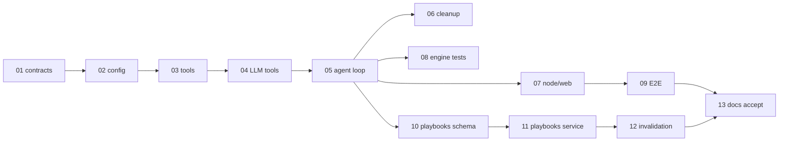

# Agent-orchestrated developer QA — implementation plans

Sequential implementation of [ADR 0026](../../adr/0026-agent-orchestrated-developer-qa.md) and
[ADR 0027](../../adr/0027-qa-investigation-playbooks.md).

**Do not skip plans.** Each plan has its own Definition of Done, doc updates, and tests. Merge one
plan (or a tight pair where noted) per PR to keep review manageable.

## Principles (from product + ADR)

- **Single QA code path** — no feature flag; no small-talk bypass; no pre-LLM `is_confident_match`
  abstain; **no** `RETRIEVAL_GRAPH_ENABLED` (graph expand is always an agent tool).
- **Evidence confidence gate** — `QA_AGENT_MIN_CONFIDENCE` default `0.8`, max `5` iterations.
- **Keep retrieval engines** — symbol, keyword, vector, graph; LLM orchestrates via tools.
- **No unnecessary file splits** — prefer one module up to ~1000 lines (`tools.py`, `agent_loop.py`)
  over many tiny files.
- **Clean repo** — delete dead code in the plan that removes it; do not leave unused modules.

## Plan sequence

| # | Plan | Delivers | ADR |
|---|---|---|---|
| 01 | [Contracts & codegen](./01-contracts-and-codegen.md) | SSE `tool_*` chunks, metrics fields, trace schema | 0026 |
| 02 | [Config & constants](./02-config-and-constants.md) | `QA_AGENT_*`, xlarge tier; remove reranker + `RETRIEVAL_GRAPH_ENABLED` | 0026 |
| 03 | [QA retrieval tools](./03-qa-retrieval-tools.md) | `services/qa/tools.py` (all tools; graph always on) | 0026 |
| 04 | [LLM tool calling](./04-llm-tool-calling.md) | Tool-call support in `vllm_client.py` + health probe | 0026 |
| 05 | [Agent loop & stream replace](./05-agent-loop-and-stream-replace.md) | `agent_loop.py`, replace `stream_answer` path; **delete small_talk** | 0026 |
| 06 | [Legacy retrieval cleanup](./06-legacy-retrieval-cleanup.md) | **Delete** `retrieve_code_chunks`, reranker, prune QA path; verify graph toggle gone | 0026 |
| 07 | [Node & web stream passthrough](./07-node-web-stream-passthrough.md) | Proxy new chunks; optional UI; persistence `investigation_trace` column prep | 0026 |
| 08 | [Engine unit & integration tests](./08-engine-agent-tests.md) | Golden scenarios, ≥80% coverage on new QA modules | 0026 |
| 09 | [E2E developer chat journey](./09-e2e-developer-chat-journey.md) | Playwright chat + citations + abstain | 0026 |
| 10 | [Playbooks schema & migration](./10-playbooks-schema-migration.md) | `qa_playbooks`, `messages.investigation_trace` | 0027 |
| 11 | [Playbooks learning service](./11-playbooks-learning-service.md) | `services/qa/playbooks.py` promotion + similarity | 0027 |
| 12 | [Playbooks invalidation & hints](./12-playbooks-invalidation-and-hints.md) | Embed hook, planner hints, warm-start flag (default off) | 0027 |
| 13 | [Documentation & ADR acceptance](./13-documentation-and-adr-acceptance.md) | Accept ADRs, update phase plans, remove stale README sections | 0026, 0027 |

## Dependency graph

## Out of scope (these plans)

- End-user / product QA (`audience = end_user`) — still abstains until Phase 6 unless a later ADR
  adds `search_docs`.
- LLM fine-tuning on traces.
- `read_file` from git worktree at query time.
- Kubernetes / multi-GPU scaling.

## Scale target

All plans assume validation against a project up to **~5M indexed LOC** (~80k–125k `code_chunks`).
See ADR 0026 §Scale; plan 02 adds the xlarge adaptive tier.
