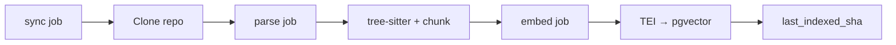

# Phase 1 — MVP Code QA

Implementation plan for Phase 1 per [`final-solution.md` §12](../final-solution.md).

**Exit criteria:** Ask a code question on one repo and receive a correct, cited answer (developer audience).

**Out of scope for Phase 1:** multi-repo linking (Phase 2), webhooks/cron freshness (Phase 3),
distillation (Phase 4), expert loop (Phase 5), end-user product QA (Phase 6).

---

## Prerequisites

| Dependency | Purpose | Notes |
|---|---|---|
| PostgreSQL + pgvector | Vectors, graph, jobs | Already in Compose |
| TEI (Text Embeddings Inference) | Code chunk embeddings | Self-hosted; `halfvec` storage |
| vLLM (or Ollama for dev) | Grounded answer generation | Self-hosted on GPU |
| Git clone access | Initial sync | Decrypt repo token from `repos.token_enc` |

Document env vars in `.env.example` as each integration lands.

---

## Milestones

### M1 — Contracts & codegen (Week 1 gate)

Lock cross-service shapes before implementation.

| Task | Owner | Files |
|---|---|---|
| Define `POST /rag/query` (SSE/stream chunks, citations, abstain) | contracts | `contracts/openapi.rag.yaml` |
| Finalize job payload types (sync → parse → embed chain) | contracts | `contracts/jobs.schema.json` |
| Generate TS types (incl. job payloads) | shared-types | `npm run codegen` |
| Generate Pydantic models for RAG + jobs | rag | py-core codegen (when wired) |

**Done when:** `npm run codegen:check` passes; both services compile against generated types.

### M2 — Indexing pipeline (critical path)

End-to-end: attach repo → indexed chunks in pgvector.

| Step | Module | Key deliverables |
|---|---|---|
| 1 | `services/sync/` | Clone/fetch repo; enumerate changed files; update `last_indexed_sha` |
| 2 | `config/` | Decrypt `repos.token_enc` (AES-256-GCM, shared key with Node) |
| 3 | `services/parsing/` | tree-sitter JS/TS/TSX; AST-aware chunking (~40–60 LOC windows) |
| 4 | `services/embedding/` | TEI client; upsert `code_chunks` (pgvector `halfvec`) |
| 5 | `services/graph/` | Extract `graph_nodes` / `graph_edges` during parse |
| 6 | `workers/handlers/` | Procrastinate consumer; dispatch sync/parse/embed; idempotent handlers |
| 7 | `repositories/indexing.py` | Upsert chunks, nodes, edges; job status updates |

**Done when:** Attach a repo via API → worker completes sync/parse/embed → `code_chunks` rows exist with embeddings.

### M3 — RAG query path

| Step | Module | Key deliverables |
|---|---|---|
| 1 | `services/retrieval/` | Vector search over `code_chunks`; optional graph expansion |
| 2 | `services/llm/` | vLLM provider; grounded prompt assembly |
| 3 | `services/router/` | Phase 1: code-only path (product router stub returns code) |
| 4 | `api/routes/query.py` | `POST /rag/query` — SSE stream of answer chunks + citations |
| 5 | Abstain path | Return "not certain" when retrieval confidence is below threshold (NFR-7) |

**Done when:** `curl POST /rag/query` with a developer question returns streamed answer + code citations.

### M4 — Node chat proxy

| Step | Module | Key deliverables |
|---|---|---|
| 1 | `modules/chat/` | WebSocket gateway (`WS /chat`) |
| 2 | Proxy | Stream RAG SSE through WebSocket to browser |
| 3 | Contracts | Chat message shapes in `openapi.node.yaml` if not already defined |

**Done when:** Authenticated WebSocket client receives streamed tokens from RAG service.

### M5 — Web UI integration

| Step | Feature | Key deliverables |
|---|---|---|
| 1 | API client | Replace `src/shared/mock/` with real typed client |
| 2 | WebSocket | Stream utility for chat answers |
| 3 | Projects | Per-repo index/job status display |
| 4 | Chat | Wire developer-audience chat to WebSocket; render real citations |

**Done when:** User logs in → attaches repo → waits for index → asks code question → sees cited streamed answer.

---

## Build order (recommended)

1. **Contracts** — unblocks all teams.
2. **Sync handler** — proves job queue end-to-end (Node enqueues → Python consumes).
3. **Parse + embed** — populates pgvector.
4. **RAG query API** — retrieval + LLM + citations.
5. **Chat WebSocket** — Node proxy.
6. **Web wiring** — replace mocks.

Each milestone should ship with colocated tests (≥ 80% JS, 100% on touched Python modules per project gates).

---

## External service setup (dev)

For local development without GPU:

- **TEI:** Run embedding model container; point `EMBEDDING_URL` at it.
- **vLLM/Ollama:** Run inference container; point `LLM_URL` at it.
- Document minimal compose overlay or `docs/development-workflow.md` addendum when services are wired.

---

## Definition of Done (Phase 1)

- [ ] Exit criteria met on a single test repo (manual or E2E in `tests/e2e/`).
- [ ] All shapes from `contracts/`; codegen drift check passes.
- [ ] Node never blocks on heavy work (sync/parse/embed/query stay in Python).
- [ ] Answers include citations; abstain path works (NFR-7).
- [ ] Tests ≥ 80% (JS) / 100% on implemented Python modules; lint + typecheck clean in CI.
- [ ] `TODO.md` / `PLAN.md` updated in each touched component.
- [ ] `.env.example` documents new variables.

---

## Risks & mitigations

| Risk | Mitigation |
|---|---|
| TEI/vLLM unavailable in CI | Mock providers in unit tests; optional manual GPU smoke test |
| Large repo clone times | File filters, size limits, skip vendored dirs (see `final-solution.md` §6.1) |
| Embedding dimension mismatch | Lock model + dimension in config; validate on first embed |
| Low retrieval quality | Tune chunk size, top-k, optional reranker (post-MVP) |

---

## References

- [`final-solution.md` §6](../final-solution.md) — indexing pipeline
- [`final-solution.md` §8](../final-solution.md) — QA serving flow
- [`architecture.md`](../architecture.md) — component map
- [`data-model.md`](../data-model.md) — schema reference
- Component plans: `apps/rag/PLAN.md`, `apps/api/PLAN.md`, `apps/web/PLAN.md`
